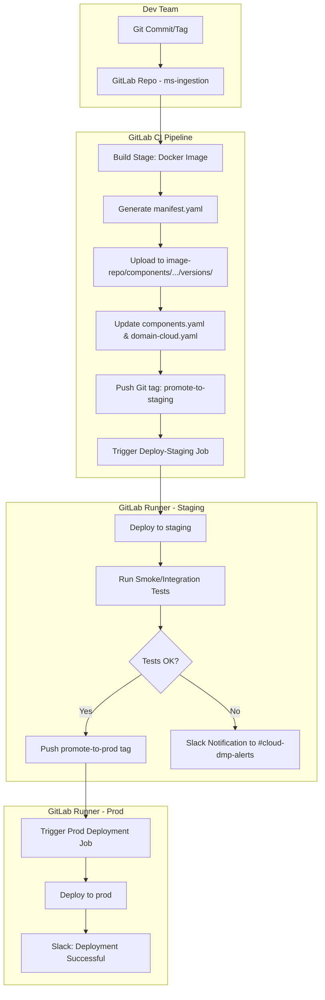
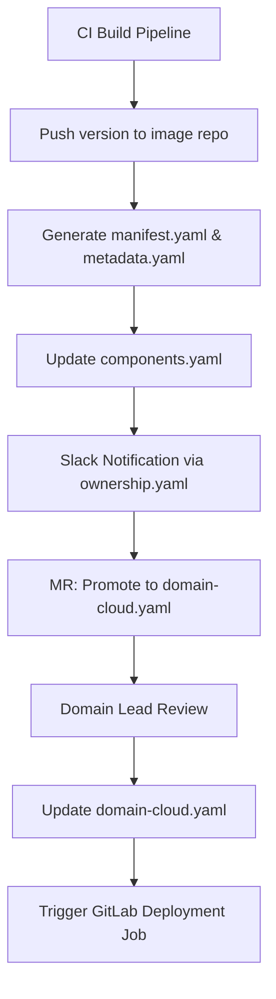

## 📦 Scalable Image Repository Design

### 🧭 Goal

To design a scalable, maintainable image repository that supports multiple packaging formats (Docker, Apt/Deb, Generic), enables component reuse across domains (Cloud, Core, RAN), and simplifies CI/CD automation while preserving logical grouping of microservices under broader platform components (e.g., DMP).

---

## ❌ Issues in Existing Structure

1. **Redundant Format-Domain Trees**

   * Each format (Docker, Apt/Deb, Generic) repeats the same domain structure.
   * Leads to duplication and possible version mismatches.

2. **Improper Grouping**

   * Components grouped under deployment domains (Cloud/Core/RAN) rather than by functionality or ownership.
   * Shared components duplicated across domains.

3. **Deployment Logic Coupled to Storage**

   * Domain-specific categorization mixed with build output.
   * Breaks reusability and complicates CI/CD.

4. **No Metadata-Driven Organization**

   * No standard for describing ownership, usage, dependencies, or tags.
   * Manual tracking of versions and domains.

5. **Scalability Issues**

   * Difficult to manage and query components as the system grows.

---

## ✅ Recommended Structure (Hierarchical + Granular)

### 📁 Folder Layout

```
/image-repo
└── components/
    └── cloud/
        └── dmp/
            ├── ms-ingestion/
            │   └── versions/
            │       └── 1.0.2/
            │           ├── docker/
            │           │   ├── image.tar
            │           │   └── manifest.yaml
            │           ├── deb/
            │           └── metadata.yaml
            ├── ms-export/
            │   └── versions/
            │       └── 3.2.0/
            └── ownership.yaml
```

* `cloud/dmp` is the logical product group.
* Each microservice (e.g., `ms-ingestion`, `ms-export`) has its own folder, versions, metadata, and manifests.

---

## 📘 Benefits

| Feature                 | Benefit                                                                       |
| ----------------------- | ----------------------------------------------------------------------------- |
| Hierarchical grouping   | Easier to locate and manage related services under one umbrella               |
| Independent versioning  | Each microservice has its own lifecycle and deployment track                  |
| Metadata-based querying | Enables automation and tagging for CI/CD workflows                            |
| Clear ownership         | `ownership.yaml` enables traceability and team coordination                   |
| Separation of concerns  | Build logic (version, format) is isolated from deployment logic (domain, env) |
| CI/CD-friendly          | Structure allows dynamic artifact resolution and validation                   |

---

## 🧾 Key Metadata Files (With Examples)

### 🔹 `metadata.yaml` (per microservice version)

Describes version-specific configuration.

```yaml
architecture: amd64
domains: ["cloud"]
environments: ["staging", "prod"]
dependencies: ["common-utils >=1.2.0"]
group: dmp
service_name: ms-ingestion
team: ingestion-platform
port_exposed: 8443
multi_arch: false
notes: "Ensure Prometheus exporter is enabled"
```

### 🔹 `manifest.yaml` (per format)

Describes artifact build details.

```yaml
format: docker
version: 1.0.2
base_image: python:3.11-alpine
sha256: f409eabc0f...
built_at: 2025-05-10T22:15:00Z
labels:
  org.opencontainers.image.revision: "abc123"
  org.label-schema.schema-version: "1.0"
```

### 🔹 `ownership.yaml` (per logical group like `dmp/`)

Defines governance, support, and traceability.

```yaml
owner_team: cloud-dmp
product_owner: priya.k@yourco.com
slack_channel: "#cloud-dmp-alerts"
source_repo: https://gitlab.com/yourorg/cloud-dmp
ci_pipeline: https://gitlab.com/yourorg/cloud-dmp/-/pipelines
audit_contact: audit-group@yourco.com
```

### 🔹 `components.yaml` (global index)

Maintains a canonical list of the latest versions of each service.

```yaml
components:
  - name: cloud/dmp/ms-ingestion
    latest_version: 1.0.2
  - name: cloud/dmp/ms-export
    latest_version: 3.2.0
```

✅ Used in CI/CD pipelines to fetch the current deployable version dynamically. This avoids hardcoding versions and supports rolling deployments, rollback logic, and automation.

### 🔹 `domain-cloud.yaml` (tag-based deployment index)

Defines which versions should be deployed in the cloud domain.

```yaml
components:
  - name: cloud/dmp/ms-ingestion
    version: 1.0.2
  - name: cloud/dmp/ms-export
    version: 3.2.0
```

✅ Used in GitLab CI/CD deploy stages to deploy the correct, environment-specific versions.

---

## 🔄 Full CI/CD Flow with GitLab (Mermaid)



---

## ⚙️ CI/CD: Handling Latest Versions and Automation

### Problem:

CI/CD must find the **latest version** of a component dynamically — without hardcoding.

### ✅ Solution:

Use `components.yaml` as the source of truth. A small YAML-parsing CLI script can retrieve the current version.

### Sample Python Helper:

```python
import yaml

def get_latest_version(component_path):
    with open('index/components.yaml') as f:
        data = yaml.safe_load(f)
        for comp in data['components']:
            if comp['name'] == component_path:
                return comp['latest_version']
    return None
```

Can be invoked during build, deploy, or validation.

---

## 🔧 GitLab Runners and Stage Tags

| Stage      | Runner Tag      | Purpose                                            |
| ---------- | --------------- | -------------------------------------------------- |
| Build      | `dmp-ci`        | Build Docker image and publish manifests           |
| Staging    | `cloud-staging` | Deploy to staging, validate functionality          |
| Production | `cloud-prod`    | Deploy approved builds to production               |
| Infra      | `infra`         | Update tag index, Slack notification, YAML parsing |

---

## 🔁 Tag-Based Promotion

Use Git tags to control promotion across environments. For example:

* `promote-to-staging`: Triggers staging deployment.
* `promote-to-prod`: Triggers production deployment of tested build.

This adds a GitOps-style audit log to the workflow.

---

## ✅ Summary

This structure and CI/CD flow:

* Organizes components clearly under product domains
* Supports per-service versioning and automation
* Powers GitLab pipelines with metadata-driven logic
* Removes hardcoded version risks via component indexes
* Enables test and promotion stages using GitLab runners and tags

The result is a highly flexible, secure, and scalable image delivery system optimized for modern development teams.


---

## 📘 Controlling `components.yaml`, `manifest.yaml`, and Related Metadata in CI/CD Workflows

### 🧭 Purpose

To explain how `components.yaml`, `manifest.yaml`, `metadata.yaml`, `ownership.yaml`, and `domain-*.yaml` files are managed and integrated into a GitLab CI/CD pipeline for automated delivery, validation, traceability, and safe deployment of microservice artifacts.

---

## 🗂️ Role of `components.yaml` in the System

### What is `components.yaml`?

A global index file that maps the latest known good version of every microservice within the image repository.

### Example

```yaml
components:
  - name: cloud/dmp/ms-ingestion
    latest_version: 1.0.3
  - name: cloud/dmp/ms-export
    latest_version: 3.2.0
```

### Purpose in CI/CD:

* Acts as a **single source of truth** for version resolution.
* Powers dynamic GitLab jobs without hardcoded version values.
* Serves as an interface between version promotion, test verification, and deployment pipelines.

---

## 📄 Role of `manifest.yaml`

### What is `manifest.yaml`?

A format-specific file that provides technical and provenance information about an artifact (e.g., Docker image, Deb package).

### Example

```yaml
format: docker
version: 1.0.3
base_image: python:3.11-alpine
sha256: abc123...
built_at: 2025-05-10T22:15:00Z
labels:
  org.opencontainers.image.revision: "abc123"
  org.label-schema.schema-version: "1.0"
```

### Purpose in CI/CD:

* Validates build reproducibility.
* Supports integrity verification during deployment.
* Provides metadata to be consumed by vulnerability scanners, policy checkers, and monitoring tools.

### Automated CI Checks:

* **Schema validation** for required fields.
* **SHA check** against actual image digest.
* **Build timestamp comparison** to reject stale builds.
* **Docker label audits** for security compliance.

---

## 📑 Role of `metadata.yaml`

### What is `metadata.yaml`?

A semantic metadata file associated with each version of a component that captures architecture, environment compatibility, dependencies, and grouping.

### Example

```yaml
architecture: amd64
domains: ["cloud"]
environments: ["staging", "prod"]
dependencies: ["common-utils >=1.2.0"]
group: dmp
service_name: ms-ingestion
team: ingestion-platform
multi_arch: false
notes: "Ensure Prometheus exporter is enabled"
```

### Purpose in CI/CD:

* Drives validation of architecture and environment compatibility.
* Enables automation in domain-specific rollouts.
* Powers platform dashboards with service details.
* Used by auto-generators to populate domain indexes and visualizations.

---

## 👥 Role of `ownership.yaml`

### What is `ownership.yaml`?

Defines ownership and operational contact for a group of components (e.g., all DMP services).

### Example

```yaml
owner_team: cloud-dmp
product_owner: priya.k@yourco.com
slack_channel: "#cloud-dmp-alerts"
source_repo: https://gitlab.com/yourorg/cloud-dmp
ci_pipeline: https://gitlab.com/yourorg/cloud-dmp/-/pipelines
audit_contact: audit-group@yourco.com
```

### Purpose in CI/CD:

* Used by Slack bots and notification scripts.
* Powers alert routing for failed builds or bad deployments.
* Surfaces repo/CI details in dashboards.

---

## 📥 Role of `domain-*.yaml` (e.g., `domain-cloud.yaml`)

### What is it?

Defines the promoted, approved versions for a specific domain/environment.

### Example

```yaml
components:
  - name: cloud/dmp/ms-ingestion
    version: 1.0.3
  - name: cloud/dmp/ms-export
    version: 3.2.0
```

### Purpose in CI/CD:

* Source of truth for deployment jobs.
* Allows safe decoupling of latest build from production deployment.
* Reviewed and promoted via MR or Git tag.

---

## 🔧 Governance Controls

| File            | Governance                  | CI Check                                      |
| --------------- | --------------------------- | --------------------------------------------- |
| components.yaml | Git commit hooks            | Valid version must exist in repo              |
| manifest.yaml   | Build stage                 | Schema, SHA, base image, timestamp validation |
| metadata.yaml   | Static check + deploy stage | Required fields, architecture compatibility   |
| ownership.yaml  | Static audit                | Must exist and match service ownership map    |
| domain-\*.yaml  | Merge request or tag-driven | Only promoted versions allowed                |

---

## 🔄 Component Promotion Flow



---

## 🔄 Downstream GitLab Usage Examples

### Dynamic Version Resolution

```yaml
deploy-prod:
  script:
    - VERSION=$(python get_latest.py cloud/dmp/ms-ingestion)
    - deploy-service cloud/dmp/ms-ingestion $VERSION
```

### Manifest Validation in CI

```yaml
validate-manifest:
  script:
    - python validate_manifest.py components/cloud/dmp/ms-ingestion/versions/1.0.3/docker/manifest.yaml
```

### Metadata + Domain Consistency Check

```yaml
audit-yamls:
  script:
    - python validate_metadata.py
    - python validate_domain_yaml.py
```

---

## ✅ Summary

* `components.yaml` tracks latest version per microservice.
* `manifest.yaml` certifies build reproducibility and integrity.
* `metadata.yaml` encodes compatibility, grouping, and dependencies.
* `ownership.yaml` ensures traceability and routing.
* `domain-*.yaml` isolates deployment control.
* All files are validated and orchestrated through GitLab CI stages.

This design provides complete control over build, test, promotion, deployment, and auditing in a secure, structured, and scalable way.
