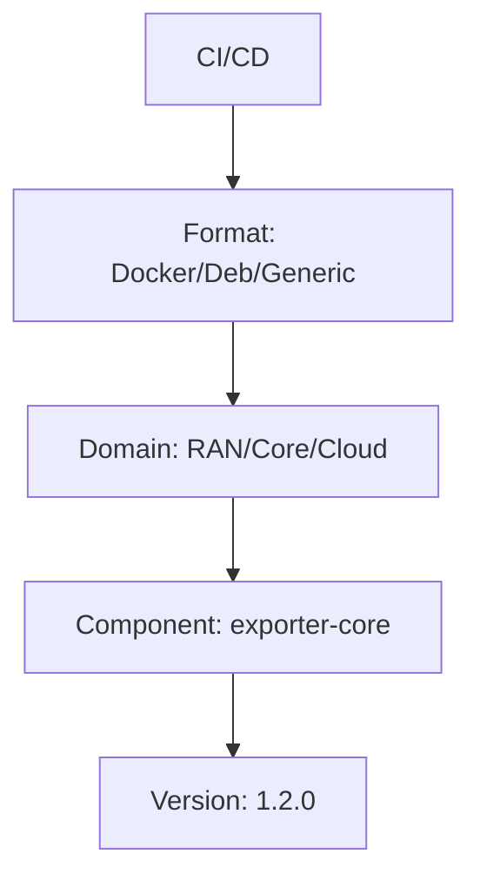
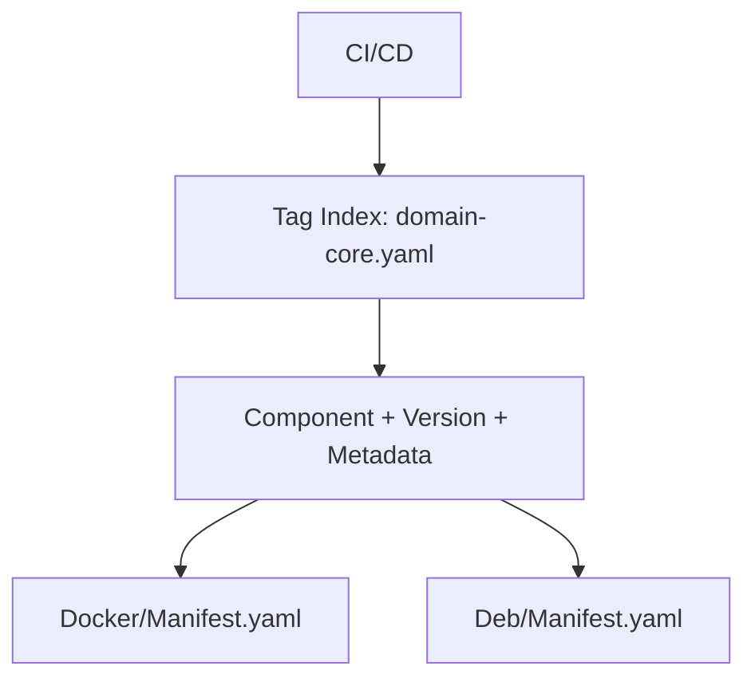

## 📦 Scalable Image Repository Design

### 🧭 Goal

To design a scalable, maintainable image repository that supports multiple packaging formats (Docker, Apt/Deb, Generic), enables component reuse across domains (Cloud, Core, RAN), and simplifies CI/CD automation.

---

## ❌ Issues in Existing Structure

1. **Redundant Format-Domain Trees**

   * Each format (Docker, Apt/Deb, Generic) repeats the same domain structure.
   * Leads to duplication and possible version mismatches.

2. **Improper Grouping**

   * Components grouped under deployment domains (Cloud/Core/RAN) rather than by functionality or ownership.
   * Shared components duplicated across domains.

3. **Deployment Logic Coupled to Storage**

   * Domain-specific categorization mixed with build output.
   * Breaks reusability and complicates CI/CD.

4. **No Metadata-Driven Organization**

   * No standard for describing ownership, usage, dependencies, or tags.
   * Manual tracking of versions and domains.

5. **Scalability Issues**

   * Difficult to manage and query components as the system grows.

---

## ✅ Recommended Structure

```
/image-repo
├── components/
│   ├── telemetry-agent/
│   │   ├── versions/
│   │   │   ├── 1.4.2/
│   │   │   │   ├── docker/
│   │   │   │   │   ├── telemetry-agent.tar
│   │   │   │   │   └── manifest.yaml
│   │   │   │   ├── deb/
│   │   │   │   │   ├── telemetry-agent.deb
│   │   │   │   │   └── manifest.yaml
│   │   │   │   ├── generic/
│   │   │   │   │   └── telemetry-agent.zip
│   │   │   │   └── metadata.yaml
│   │   └── ownership.yaml
├── index/
│   ├── components.yaml
│   ├── tags/
│   │   ├── domain-ran.yaml
│   │   ├── domain-core.yaml
│   │   ├── domain-cloud.yaml
│   │   └── ci-tags.yaml
```

---

## 📘 Benefits

| Feature                      | Benefit                                      |
| ---------------------------- | -------------------------------------------- |
| Centralized component layout | Avoids duplication across domains/formats    |
| Format-agnostic versioning   | Easy automation for artifact fetching        |
| Metadata-based tagging       | Dynamic CI/CD targeting                      |
| Clear ownership              | Faster debugging, better governance          |
| Supports scale               | 100s of components, 1000s of versions        |
| Separation of concerns       | Build vs Deployment context cleanly isolated |

---

## 🧾 Key Metadata Files

### `manifest.yaml`

```yaml
format: docker
version: 1.4.2
base_image: alpine:3.18
sha256: abc123...
built_at: 2025-05-10T12:00:00Z
```

### `metadata.yaml`

```yaml
architecture: amd64
domains: ["ran", "core"]
environments: ["staging", "prod"]
dependencies: ["lib-ssl", "utils"]
```

### `ownership.yaml`

```yaml
owner_team: telemetry
slack_channel: #team-telemetry
source_repo: https://gitlab.com/netco/telemetry-agent
ci_pipeline: https://gitlab.com/netco/telemetry-agent/-/pipelines
```

---

## 🧠 Why This Structure Is Better

### 🧭 Deployment Flow (Old vs New)

#### ❌ Old Flow



* CI/CD must hardcode path logic.
* Shared components are duplicated in multiple domain paths.

#### ✅ New Flow



* CI/CD fetches metadata by tag.
* Domains are labels, not folders.
* Components are stored once, reused many times.

---

## 🔍 Use Cases and Examples

### Example 1: Deploying Core Monitoring Stack

```yaml
# domain-core.yaml
components:
  - name: telemetry-agent
    version: 1.4.2
  - name: alertmanager
    version: 0.23.0
```

* A pipeline pulls these components based on the `core` domain tag.
* Uses `metadata.yaml` to verify architecture and environment compatibility.

### Example 2: Fetching Dependencies for a CI Job

* Suppose a new telemetry-agent build needs `lib-ssl >=1.1.0` and `utils`.
* CI reads `metadata.yaml` → installs those before proceeding to Docker build.

### Example 3: Auto-Validation of Tag Index

* A GitLab job runs nightly to crawl `components/*/versions/*/metadata.yaml`.
* Verifies tag lists (`domain-core.yaml`, etc.) are consistent with actual content.

### Example 4: Slack Notification on New Release

* When a new `alertmanager` version is uploaded:

  * A webhook reads `ownership.yaml`
  * Sends release notification to `#team-observability`

---

## 🚀 Automation Possibilities

* 🔍 Query by domain tag: `index/tags/domain-core.yaml`
* 📦 Rollout all components for RAN using tag list.
* 🔄 Regenerate tag indexes using metadata crawler.
* 🧪 Validate versions + dependencies in CI pre-deploy.
* 🔔 Notify owners automatically on publish.

---

## ✅ Summary

This structure:

* Removes redundancy
* Enables clean separation of concerns
* Improves automation
* Supports growth and reuse

It's metadata-driven, CI/CD-friendly, and domain-agnostic — the way modern image repositories should be.
