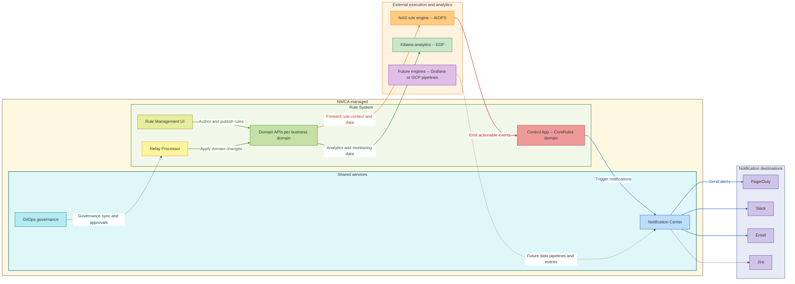

# **Rule System – Business Architecture Overview**

---

## **1. Purpose**

The **Rule System** is a unified, cross-domain framework developed and managed by the **Network Core Automation (NWCA)** team.
It enables the **definition, validation, governance, and execution** of operational rules across multiple business and network domains while ensuring transparency, compliance, and reliability.

This system integrates **governance (GitOps)**, **execution (NAS, Kibana)**, and **notification (Notification Center)** layers to form a cohesive automation fabric across Bell’s core platforms.

---

## **2. Core Business Capabilities**

| Capability                       | Description                                                                                                                                                                                         |
| -------------------------------- | --------------------------------------------------------------------------------------------------------------------------------------------------------------------------------------------------- |
| **Authoring & Publishing**       | The centralized Rule Management UI allows business and technical users to author, validate, and publish rules across multiple domains.                                                              |
| **Cross-Domain Synchronization** | The Relay Processor ensures GitLab-based rule repositories are synchronized with each domain API, handling retries and consistency across all environments.                                         |
| **Execution & Analytics**        | Rules are executed and visualized through external engines such as NAS (managed by AIOPS) and Kibana (managed by EDP). The framework is extensible to future engines like Grafana or GCP pipelines. |
| **Governance & Traceability**    | The GitOps layer enforces structured approvals, auditability, and version control for every rule modification.                                                                                      |
| **Notification & Visibility**    | The Notification Center aggregates and distributes actionable insights and system alerts to PagerDuty, Slack, Email, and Jira, improving visibility and operational response.                       |

---

## **3. Architecture Context**

The Rule System is designed to provide **autonomous execution with centralized governance**.

* Each **domain microservice** (e.g., ELK, CoreRules) manages its own lifecycle and data.
* The **Relay Processor** synchronizes domain configurations automatically when new rules are approved in GitLab.
* The **GitOps layer** ensures approval, rollback, and traceability for every configuration or rule update.
* **External execution platforms** (NAS, Kibana, and others) process and analyze rule outcomes.
* The **Notification Center** provides cross-domain visibility and business transparency.

This architecture ensures **real-time automation**, **end-to-end observability**, and **enterprise-grade governance** across NWCA-managed services.

---

## **4. High-Level Architecture**

---

## **5. Business Flow**

1. **Rule Authoring & Publication**
   Users create and validate rules via the **Rule Management UI**, which connects to per-domain APIs (CoreRules, ELK, etc.) for schema validation and persistence.

2. **Governance & Approval**
   Rule updates are version-controlled through **GitOps workflows** (managed by NWCA) that enforce peer reviews and compliance checks before deployment.

3. **Relay & Synchronization**
   Once approved, the **Relay Processor** consumes GitLab webhooks and updates respective domain APIs, ensuring consistency and fault tolerance.

4. **Execution & Analytics**

   * **NAS (AIOPS-managed):** Executes automation logic and emits actionable events.
   * **Kibana (EDP-managed):** Provides analytics dashboards and rule performance visibility.
   * **Future Engines:** Framework supports integration with Grafana or GCP pipelines for future analytics use cases.

5. **Notifications & Reporting**
   The **Control App** captures execution outcomes and triggers the **Notification Center**, which delivers real-time alerts to Slack, PagerDuty, Email, and Jira.

---

## **6. Business Value**

| Business Area               | Impact                                                                                    |
| --------------------------- | ----------------------------------------------------------------------------------------- |
| **Operational Automation**  | Streamlines cross-domain configuration and response workflows, reducing manual effort.    |
| **Governance & Compliance** | GitOps enforces transparent, traceable rule management with version control.              |
| **Extensibility**           | Designed to support new analytical and automation engines seamlessly.                     |
| **Reliability**             | Relay Processor ensures delivery consistency and resiliency.                              |
| **Visibility**              | Notification Center provides complete cross-domain awareness and traceable rule outcomes. |

---

## **7. Ownership and Accountability**

| Component                              | Primary Owner | Supporting Teams          |
| -------------------------------------- | ------------- | ------------------------- |
| **Rule Management UI & Domain APIs**   | NWCA          | Domain Leads              |
| **Relay Processor**                    | NWCA          | DevOps                    |
| **Control App**                        | NWCA          | Platform Operations       |
| **GitOps Governance**                  | NWCA          | DevOps Governance         |
| **Notification Center**                | NWCA          | Operations Engineering    |
| **NAS Rule Engine**                    | AIOPS         | Core Platform             |
| **Kibana Analytics**                   | EDP           | Data Visualization        |
| **Future Integrations (Grafana, GCP)** | NWCA          | AIOPS / EDP (as required) |

---

## **8. Summary**

The Rule System, led by **NWCA**, forms the foundation of Bell’s network automation and observability framework.
By integrating governance, automation, and analytics under one architecture, it ensures:

* **Single-source rule management** across domains.
* **Governed deployment pipeline** with GitOps-driven traceability.
* **Seamless integration** with external analytics and AI-driven execution engines.
* **End-to-end visibility** through centralized notification and reporting mechanisms.

This design enables Bell to achieve **faster decision cycles**, **predictive automation**, and **consistent compliance** across its operational ecosystem.
