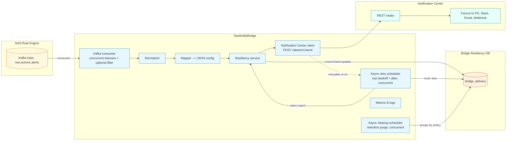

# NasNotifyBridge High-Level Design

## 1) Purpose

Consume **NAS actions** from Kafka, normalize the payload, select destinations/templates via a **JSON config file**, persist a minimal delivery record to a **resiliency DB**, call the **Notification Center** REST API, and perform **DB-driven asynchronous retries** with **exponential backoff + jitter**.
**No DLQ, no retry topic, no in-memory queues/dedupe.**

---

## 2) Architecture (at a glance)



---

## 3) Scope

**In**: Kafka ingest (concurrent) → normalize → map → persist → send → **async DB-driven retry** → **async cleanup**.

**Out**: DLQ, retry topics, in-memory queues/dedupe, template rendering, provider secrets.

---

## 4) Key Flows (explicit concurrency)

### 4.1 Kafka Ingest (concurrent)

* **Optional filter**: drop non-CoreRules or irrelevant actions before DB.
* **Per message** (handled by a listener thread):

  1. Normalize → Map (from `mappings.json`).
  2. `INSERT` into `bridge_delivery` with `status=PENDING, attempts=0, next_attempt_at=now()`.
  3. Call Notification Center **once**.
  4. Update row: `SENT` (2xx) / `FAILED` (retryable) / `GAVE_UP` (non-retryable 4xx).
  5. **Update DB and move on** — no blocking / waiting.
* **Offset commit**: commit **after successful DB insert** (so work is durable before commit).

### 4.2 Async Retry (scheduled, concurrent)

* Fixed-delay scheduler wakes; **claims** due rows (`status in (PENDING,FAILED)` and `next_attempt_at <= now()`), with **lease** (`claimed_by/claimed_at`) to avoid cross-pod duplication.
* Hands rows to an **R-sized worker pool**; calls NC in parallel.
* On result: `SENT` / `FAILED` (+ backoff) / `GAVE_UP`.
* The scheduler **never blocks** on individual failures; it just updates DB and continues.

### 4.3 Async Cleanup (scheduled, concurrent)

* Cron scheduler with a **C-sized pool** performs batched purges:

  * Delete `SENT` older than `retention.sentDays`.
  * Delete `FAILED/GAVE_UP` older than `retention.failedDays`.
* Chunked deletes to keep locks short; errors are logged and the job continues.

---

## 5) Resiliency DB (single table)

**Table**: `bridge_delivery` (H2 on PVC; Postgres-portable).
**Columns** (essentials):

* Identity & snapshot: `nas_event_id`, `event_key`, `action_type`, `severity`, `environment`, `domain='CoreRules'`, `labels_json`, `payload_json`, `destinations_json`.
* Lifecycle: `status ∈ {PENDING,SENT,FAILED,GAVE_UP}`, `attempts`, `next_attempt_at`, `last_error`, `external_resp`.
* Concurrency: `claimed_by`, `claimed_at` (lease).
* Timestamps: `created_at`, `updated_at`.
  **Indexes**: `(status,next_attempt_at)`, `(event_key,created_at)`, `(created_at)`.

**Claim pattern (sketch)**:

```sql
-- Claim a batch (at-most-once per replica)
UPDATE bridge_delivery
SET claimed_by = :instanceId, claimed_at = CURRENT_TIMESTAMP
WHERE id IN (
  SELECT id FROM bridge_delivery
  WHERE status IN ('PENDING','FAILED')
    AND (next_attempt_at IS NULL OR next_attempt_at <= CURRENT_TIMESTAMP)
    AND (claimed_by IS NULL OR claimed_at < CURRENT_TIMESTAMP - INTERVAL '5' MINUTE)
  ORDER BY created_at
  FETCH FIRST :limit ROWS ONLY
);
```

---

## 6) Retry Taxonomy

* **Retryable**: HTTP **429**, any **5xx**, **network errors**, **timeouts**.
* **Non-retryable**: HTTP **4xx** from Notification Center (schema/validation/mapping errors).
* **Max attempts**: configurable (default **6**); on exceeding → **`GAVE_UP`**.

---

## 7) Backoff (full jitter)

```
attempts := attempts + 1
base := RETRY_BASE_MS        # e.g., 5000
cap  := RETRY_MAX_MS         # e.g., 300000
exp  := min(cap, base * 2^attempts)
delay := random(0, exp)      # full jitter
next_attempt_at := now() + delay
```

---

## 8) External Contracts

### 8.1 NAS → Bridge (Kafka JSON — required fields)

```json
{
  "eventId": "nas-8e4f5b",
  "ts": "2025-10-20T15:09:05Z",
  "actionType": "RULE_VIOLATION",
  "severity": "HIGH",
  "environment": "prod",
  "domain": "CoreRules",
  "entity": { "type": "rule", "id": "rule-123" },
  "labels": { "team": "core" },
  "payload": { "error": "timeout" },
  "dedupKey": "CoreRules:rule-123:violation"
}
```

**Commit semantics**: commit Kafka offset **after** the row is inserted into DB.

### 8.2 Bridge → Notification Center (REST)

`POST /alerts/v1/send`

```json
{
  "eventKey": "CoreRules:rule-123:violation",
  "title": "CoreRules violation: rule-123",
  "severity": "HIGH",
  "environment": "prod",
  "domain": "CoreRules",
  "labels": { "team": "core" },
  "payload": { "error": "timeout" },
  "destinations": [
    { "configRef": "pd_core_oncall", "templateName": "pd-default", "versionSelector": "latest" },
    { "configRef": "slack_core_ops", "templateName": "slack-default", "versionSelector": 2 }
  ]
}
```

**EventKey**: prefer NAS `dedupKey`; else compute deterministically (e.g., `"{domain}:{actionType}:{entity.id}"` plus stable extras if needed).

---

## 9) JSON Mapping Config (and Guarantees)

**Path**: `/etc/nas-bridge/config/mappings.json` (first-match-wins; validated at boot).
**Example**:

```json
{
  "version": "1.0",
  "defaults": { "versionSelector": "latest" },
  "rules": [
    {
      "when": { "actionType": "RULE_VIOLATION", "severity": ["CRITICAL", "HIGH"] },
      "routes": [
        { "channelRef": "pd_core_oncall",  "templateName": "pd-default" },
        { "channelRef": "slack_core_ops",  "templateName": "slack-default" }
      ]
    },
    {
      "when": { "actionType": "RULE_APPLY_FAILED" },
      "routes": [
        { "channelRef": "slack_core_ops",  "templateName": "slack-apply-failed" }
      ]
    }
  ]
}
```

**Guarantees**:

* Boot-time JSON Schema validation (required fields; allowed severities; no overlapping rules).
* App **fails fast** on invalid config.
* Version field required for traceability.

---

## 10) Non-Functional Targets (NFRs)

* **Throughput**: ≥ **500 msgs/s** per pod (scale with listener concurrency).
* **Ingest→persist latency**: **≤ 50 ms avg**.
* **NC call**: **p50 ≤ 300 ms**, **p95 ≤ 1 s**.
* **Availability**: **99.9%** (stateless workers + DB on PVC).
* **Durability**: no loss after persist (insert-before-send).
* **Recovery**: reclaim all due rows within **≤ 60 s** after restart.

---

## 11) Security & Networking

* **Kafka**: SASL/SCRAM or mTLS (decide per environment); credentials via Secret; egress locked to brokers.
* **Notification Center**: mTLS (preferred) or HMAC header; 2 s connect/read timeouts; **no client-side automatic retries** (we do retries in the scheduler to avoid double backoff).
* **Logging/PII**: redact known keys; cap `labels_json`/`payload_json` size stored/logged (e.g., ≤ 16 KB).

---

## 12) HA, Scaling & Back-pressure

* **Replicas** ≤ topic partitions; `listener.concurrency × replicas ≤ partitions`.
* **Leases**: `claimed_by/claimed_at` with `bridge.retry.lease.minutes` (default 5m); reclaim if stale.
* **Back-pressure controls**: `claim.batchSize`, worker pool sizes, NC timeouts.

---

## 13) Observability & Alerts

**Metrics** (Micrometer):

* `nas_messages_consumed_total{actionType,severity}`
* `bridge_sent_total`, `bridge_failed_total`, `bridge_gave_up_total`
* `retry_scheduled_total`, `retry_attempts_total`
* `nc_status_count{code}`, `nc_latency_ms`
* `scheduler_oldest_due_seconds` (age of oldest due)

**Health/Readiness**:

* Liveness: JVM + DB connectivity.
* Readiness: Kafka assignments ok, DB writable, NC probe success within last 60 s.

**Alerting suggestions**:

* Retry backlog (due rows) > threshold for 5 min.
* `GAVE_UP` rate > X/min.
* NC p95 latency > 1 s for 5 min.
* Scheduler lag (oldest due age) > Y minutes.
* Config load failure (fail fast).

---

## 14) Data Retention & Capacity

* **PVC**: start at **10 GiB** (tune later).
* Growth: ~1 row per NAS message; steady state bounded by purge.
* **Retention**: `SENT > 7d`; `FAILED/GAVE_UP > 30d` (tunable).
* **Cleanup**: chunked deletes (e.g., 1000 rows/batch).

---

## 15) Configuration Surface (properties)

```properties
# Kafka
bridge.kafka.bootstrap=broker:9093
bridge.kafka.topic=nas.actions.alerts
bridge.kafka.groupId=nas-notify-bridge
bridge.kafka.listener.concurrency=6
bridge.kafka.filter.enabled=true
bridge.kafka.filter.includeDomain=CoreRules

# Notification Center
bridge.nc.baseUrl=http://notification-center.svc.cluster.local
bridge.nc.timeout.ms=2000
bridge.nc.auth.mode=mtls  # or hmac

# Retry scheduler
bridge.retry.enabled=true
bridge.retry.schedule.fixedDelay.ms=10000
bridge.retry.workers=8
bridge.retry.claim.batchSize=200
bridge.retry.base.ms=5000
bridge.retry.max.ms=300000
bridge.retry.max.attempts=6
bridge.retry.lease.minutes=5

# Cleanup scheduler
bridge.cleanup.enabled=true
bridge.cleanup.schedule.cron=0 0 * * * *   # hourly
bridge.cleanup.workers=2
bridge.cleanup.batchSize=1000
bridge.retention.sent.days=7
bridge.retention.failed.days=30

# Resiliency DB (H2 on PVC)
spring.datasource.url=jdbc:h2:file:/data/bridge/bridge-db;MODE=PostgreSQL;DB_CLOSE_DELAY=-1
spring.jpa.hibernate.ddl-auto=validate

# Mapping config
bridge.config.dir=/etc/nas-bridge/config
bridge.mappings.json=${bridge.config.dir}/mappings.json
```

---

## 16) Ops Runbooks (single screen)

* **NC down/slow** → Retry backlog grows; watch “oldest due age” & “retries scheduled”. No manual intervention; system recovers when NC does.
* **Bad mapping (4xx)** → Rows marked `GAVE_UP`; fix `mappings.json`, redeploy; use SQL to re-queue specific events if needed.
* **Stuck claims** → Check clocks; reduce `bridge.retry.lease.minutes` and redeploy to reclaim.

---


## Why use a **mapping JSON** instead of “creating a model class that maps the structure of the JSON”?

Short answer: we need **two different concerns**:

1. **Data shape (DTOs)** — yes, we still use model classes to parse NAS messages and to build the Notification Center request. This is about **schema**.

2. **Routing policy (mapping rules)** — which **destinations** and **templates** to use given fields like `actionType`, `severity`, `labels.*`, etc. This is **behavior/config**, not schema.

Putting routing policy into code (enums/if-else in a model class) creates tight coupling and code deployments for every change. Keeping it in a **JSON mapping file** gives you:

* **Decoupling & agility**: update routes/templates without a deploy (ConfigMap rollout).
* **Environment variability**: different mappings per env or tenant by mounting different files.
* **Safety**: boot-time validation can verify channel refs and severities before the app starts.
* **Auditability**: mapping changes are diff-able and reviewable as config, not code.
* **Least blast radius**: mapping tweaks don’t touch parser/DTOs or retry logic.

So: **use model classes for payloads**, and **use JSON mapping for routing decisions**. They complement each other, not replace each other.

