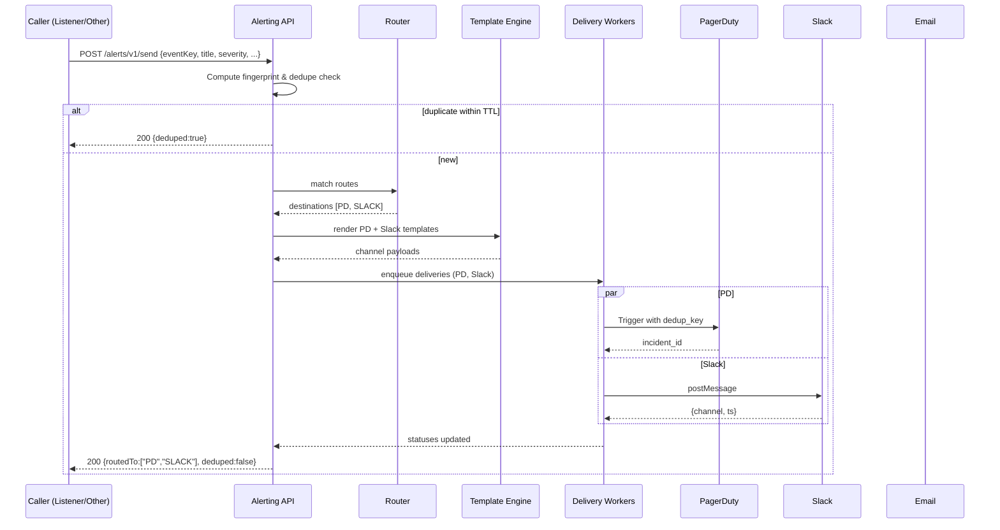

# Alerting App — Design (independent of rule system)

## 1) Scope & principles

* **Source-agnostic**: accepts alert requests from any producer (APIs for now; Kafka/Events later).
* **Multi-channel**: PagerDuty (PD), Slack, Email (SMTP/SendGrid), “other” (webhooks, MS Teams, etc.).
* **Declarative routing**: rules map **input attributes → destinations + templates**.
* **Idempotent + de-dup**: no duplicate pages for the same incident key / fingerprint.
* **Separation of concerns**: this app only handles alert intake, routing, formatting, and delivery; it is not a rule engine.

## 2) High-level architecture

* **API Gateway** (Spring Boot): `/alerts/v1/send` (sync ack), `/alerts/v1/batch`, `/health`, `/metrics`.
* **Router**: evaluates routing rules (by domain/team/severity/env/labels/tenant).
* **Template Engine**: channel-specific templates (Slack block kit, PD payloads, email HTML/text).
* **Delivery Workers**: PD client, Slack client, Email client, Webhook client — each with retries/backoff.
* **Idempotency Store & Dedupe**: short-TTL keys per alert fingerprint.
* **Persistence**: alert request, routing decision, deliveries, attempts, errors.
* **(Optional Later)**: Ingest queue (Kafka) for burst smoothing; dead-letter topic for persistent failures.

## 3) Core data model (tables)

```sql
-- One row per submitted alert (logical request)
CREATE TABLE alert_event (
  id BIGSERIAL PRIMARY KEY,
  event_key VARCHAR(128) NOT NULL,             -- caller-supplied idempotency key or computed fingerprint
  source_system VARCHAR(64) NOT NULL,          -- e.g., 'listener', 'cm-api', 'manual'
  title VARCHAR(512) NOT NULL,
  severity VARCHAR(16) NOT NULL CHECK (severity IN ('CRITICAL','HIGH','MEDIUM','LOW','INFO')),
  environment VARCHAR(32) NOT NULL,            -- 'prod','stg', etc.
  domain VARCHAR(64) NOT NULL,                 -- 'EMA','CoreRules','Grafana', 'NFOrch', etc.
  labels JSONB,                                -- arbitrary key/values for routing (team, nf, region)
  payload JSONB,                               -- original body (for templates)
  created_at TIMESTAMP(3) NOT NULL DEFAULT NOW(),
  dedupe_ttl_seconds INT NOT NULL DEFAULT 900  -- how long identical alerts are suppressed
);

-- Declarative routing (who gets notified)
CREATE TABLE alert_route (
  id BIGSERIAL PRIMARY KEY,
  name VARCHAR(128) UNIQUE NOT NULL,
  predicate JSONB NOT NULL,  -- DSL: { "all": [ {"eq":{"field":"domain","value":"EMA"}}, {"in":{"field":"severity","values":["CRITICAL","HIGH"]}} ] }
  destinations JSONB NOT NULL, -- e.g., [{"type":"PD","configRef":"pd_ema_oncall"}, {"type":"SLACK","configRef":"slack_ema_ops"}]
  enabled BOOLEAN NOT NULL DEFAULT TRUE,
  priority INT NOT NULL DEFAULT 100, -- smaller = higher precedence
  updated_at TIMESTAMP(3) NOT NULL DEFAULT NOW()
);

-- Destination configs (secrets via Vault; store refs and non-secret metadata here)
CREATE TABLE alert_destination_config (
  id BIGSERIAL PRIMARY KEY,
  ref VARCHAR(128) UNIQUE NOT NULL, -- e.g., 'pd_ema_oncall'
  type VARCHAR(32) NOT NULL CHECK (type IN ('PD','SLACK','EMAIL','WEBHOOK')),
  non_secret JSONB,                 -- channel, team, email list, endpoint URL
  created_at TIMESTAMP(3) NOT NULL DEFAULT NOW()
);

-- Templates per channel
CREATE TABLE alert_template (
  id BIGSERIAL PRIMARY KEY,
  name VARCHAR(128) UNIQUE NOT NULL, -- e.g., 'ema_incident_default'
  channel VARCHAR(32) NOT NULL CHECK (channel IN ('PD','SLACK','EMAIL','WEBHOOK')),
  format VARCHAR(16) NOT NULL CHECK (format IN ('JSON','TEXT','HTML')),
  body TEXT NOT NULL,                 -- handlebars/mustache or Kotlin string templates
  updated_at TIMESTAMP(3) NOT NULL DEFAULT NOW()
);

-- Delivery tracking (one per channel delivery)
CREATE TABLE alert_delivery (
  id BIGSERIAL PRIMARY KEY,
  alert_event_id BIGINT NOT NULL REFERENCES alert_event(id),
  destination_ref VARCHAR(128) NOT NULL,
  channel VARCHAR(32) NOT NULL,
  status VARCHAR(16) NOT NULL CHECK (status IN ('PENDING','SENT','FAILED','GAVE_UP')),
  external_id VARCHAR(256),          -- PD incident id, Slack ts, MessageId, etc.
  last_error TEXT,
  attempts INT NOT NULL DEFAULT 0,
  next_attempt_at TIMESTAMP(3),
  created_at TIMESTAMP(3) NOT NULL DEFAULT NOW(),
  updated_at TIMESTAMP(3) NOT NULL DEFAULT NOW()
);
```

## 4) Routing model

* **Predicate DSL** (simple, readable JSON): supports `eq`, `in`, `prefix`, `regex`, `any/all` over fields from event (`domain`, `severity`, `environment`, `labels.*`).
* **Priority**: first match wins; fallthrough to default route if none.
* **Examples**

  * EMA CRITICAL in prod → PD on-call + Slack `#ema-p1`.
  * CoreRules HIGH/CRITICAL in any env → Slack `#corerules-ops`.
  * NFOrch any severity in prod with `labels.nf_group=core` → PD + Email to on-call distro.

## 5) API (initial, API-only ingestion)

**Auth**: mTLS or Bearer; per-client rate limits; per-tenant quotas.

* `POST /alerts/v1/send`

  * **Request**

    ```json
    {
      "eventKey": "ema:rule-123:apply-failed",   // optional but recommended
      "title": "EMA Apply Failed: rule-123",
      "severity": "CRITICAL",
      "environment": "prod",
      "domain": "EMA",
      "labels": { "ruleName": "rule-123", "region": "qc", "team": "ema" },
      "payload": { "error":"timeout to kibana api", "mr": 23, "projectId": 101 },
      "dedupeTtlSeconds": 900
    }
    ```
  * **Response**

    ```json
    { "id": 987654, "routedTo": ["PD:pd_ema_oncall","SLACK:slack_ema_ops"], "deduped": false }
    ```
* `POST /alerts/v1/batch` — array of above (best-effort partial success).
* `GET /alerts/v1/events/{id}` — status + deliveries.
* `POST /alerts/v1/routes:match` — dry-run to test routing (for config reviews).
* `POST /admin/routes` / `PUT /admin/templates` / `POST /admin/destinations` — admin endpoints (RBAC-gated).

## 6) Idempotency & de-dup

* **Fingerprint**: prefer caller’s `eventKey`; if absent, compute hash of `(domain, severity, title, labels, canonical payload subset)`.
* **Short TTL cache** (Redis) + DB check: if fingerprint seen within TTL → respond `deduped=true` and skip deliveries (or update existing PD incident note instead if channel supports aggregation).
* **PagerDuty de-dup key**: pass the same `eventKey` as PD’s `dedup_key` to coalesce triggers.

## 7) Delivery semantics

* **PD**: Events v2 API (Trigger/Resolve) with `dedup_key`, `routing_key` from Vault; send custom fields in `custom_details`.
* **Slack**: chat.postMessage (or incoming webhook) with Block Kit; return `channel` + `ts`.
* **Email**: SMTP or provider API (SendGrid). Support HTML + TEXT templates; `to/cc/bcc` from route config.
* **Webhook/Others**: signed POST with channel-specific JSON.

**Retry policy (per delivery row)**

* Backoff: `min( base * 2^attempts, maxBackoff )`; jitter; cap attempts (e.g., 6).
* Mark `GAVE_UP` after max attempts; keep `last_error`.

## 8) Templates (per channel)

Use a simple, safe templating (Mustache/Handlebars) with a strict context:

* **Slack (Block Kit) example**

````json
{
  "blocks": [
    { "type": "header", "text": { "type": "plain_text", "text": "{{title}}" } },
    { "type": "section", "fields": [
      { "type": "mrkdwn", "text": "*Severity:*\n{{severity}}" },
      { "type": "mrkdwn", "text": "*Domain:*\n{{domain}}" },
      { "type": "mrkdwn", "text": "*Env:*\n{{environment}}" },
      { "type": "mrkdwn", "text": "*Rule:*\n{{labels.ruleName}}" }
    ] },
    { "type": "section", "text": { "type": "mrkdwn", "text": "```{{payload.error}}```" } }
  ]
}
````

* **PagerDuty trigger**

```json
{
  "routing_key": "{{secret.routingKey}}",
  "event_action": "trigger",
  "dedup_key": "{{eventKey}}",
  "payload": {
    "summary": "{{title}}",
    "severity": "{{lowercase severity}}",
    "source": "{{domain}}-{{environment}}",
    "custom_details": {{json payload}}
  }
}
```

## 9) Security, governance, and ops

* **AuthN/Z**: mTLS between trusted backends; or OAuth2 service accounts; per-client scopes (which domains/severities they can send).
* **Quotas/Rate limits**: protect PD/Slack from floods; per-client + global.
* **Secrets**: PD routing keys, SMTP creds via Vault; configs reference Vault paths.
* **Audit**: persist every request + routing decision + delivery outcomes; immutability for compliance.
* **Metrics**: per channel success/failure, latency, dedupe rate, retry depth; SLOs:

  * P50 delivery < 2s (Slack), < 3s (PD), < 5s (Email).
  * Error budget alerts on failure rates > 1%/5m.
* **Runbooks**: rotate PD keys, Slack webhook migration, email fallback to secondary MX, DLQ drain procedure.

## 10) Failure modes & graceful behavior

* **Channel down**: continue other channels; mark failed channel with retry/backoff.
* **Provider throttling**: honor `Retry-After`; widen backoff.
* **PD triggered but Slack failed**: still 200 on intake; delivery table shows partial failure; operator can re-drive a single destination.
* **Storms**: enable dynamic suppression windows (e.g., collapse same fingerprint to PD notes or Slack thread replies instead of new messages).

## 11) Minimal flow (Mermaid)



## 12) Example integration from the Listener

When `listener_status=SUCCESS` for “EMA Apply Failed” recovery or “Apply Succeeded”:

* Listener calls:

```json
POST /alerts/v1/send
{
  "eventKey": "ema:rule-123:apply-failed:mr101/23",
  "title": "EMA Apply Failed: rule-123 (MR 23)",
  "severity": "CRITICAL",
  "environment": "prod",
  "domain": "EMA",
  "labels": { "ruleName": "rule-123", "mr": "23", "projectId": "101", "team": "ema" },
  "payload": { "error":"timeout to kibana api", "attempt": 3 }
}
```

* Routing sends PD + Slack with templated, consistent formatting.

## 13) Build notes (Kotlin + Spring Boot)

* Packages:

  * `controller` (ingress, admin), `service` (router, template, delivery), `clients` (pd, slack, email, webhook), `repo`, `model`, `security`, `config`.
* Use `@Validated` DTOs; `Constraint` for severity; `HandlerMethodArgumentResolver` for tenant.
* Template engine: Handlebars or Pebble; JSON fragments rendered safely.
* Async: Spring `@Async` or virtual threads; for scale, adopt a queue (Kafka) between API and workers.
* Metrics: Micrometer + Prometheus; health groups per channel.
* Vault: Spring Cloud Vault for secret injection by `configRef`.
