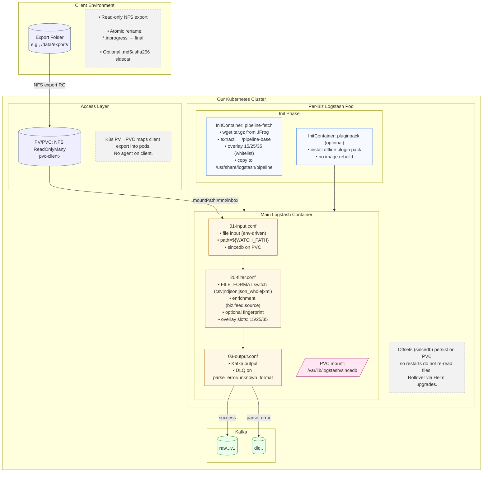

# **Logstash File Ingestion Framework – Runtime Pipeline Fetch Design**

This document defines the **standard architecture** for file ingestion into Kafka using **Logstash**, managed via **Helm-deployed per-business (biz) repositories**.
It cleanly separates **shared pipeline logic (base repo)** from **deployment ownership (biz repos)** while preserving version control, flexibility, and governance.

---

## **1) End-to-End Architecture (Mermaid)**



---

## **2) Repository & Artifact Layout**

```
logstash-pipelines-base/           (shared repo)
 ├─ pipelines/
 │   ├─ 01-input.conf
 │   ├─ 20-filter.conf
 │   ├─ 03-output.conf
 │   ├─ patterns/common.grok
 │   └─ README.md (contract + envs)
 └─ version.txt  (e.g., 1.3.0)
         │
         ▼  publish tar.gz to JFrog
JFrog: acme-logstash-pipelines-base-1.3.0.tar.gz

logstash-<biz>/                    (per-biz repo)
 ├─ charts/logstash/               (Helm chart owned by biz)
 │   ├─ templates/statefulset.yaml
 │   ├─ templates/init-pipeline-fetch.yaml   # runtime fetch (whitelist 15/25/35 only)
 │   ├─ templates/init-plugins.yaml          # optional PluginPack
 │   ├─ templates/service.yaml
 │   └─ values-*.yaml
 ├─ overlay-pipelines/
 │   ├─ 15-prefilter.conf          # pre-parse slot
 │   ├─ 25-midfilter.conf          # post-parse slot
 │   └─ 35-postfilter.conf         # pre-output slot
 ├─ plugins/ (offline packs)
 └─ ci/
```

**Principles**

* Base repo publishes **pipeline templates only**.
* Biz repos **fetch at runtime**, **never overwrite** base files — only supply **15/25/35** overlay files.

---

## **3) Why Logstash (and not rsync, rsyslog, or others)?**

### 3.1 rsync / cron+scp (file copy tools)

* **Copy-only**: they move bytes, not records; no parsing, validation, DLQ, or schema-minded routing.
* **No offsets/checkpointing per record**: if a job fails mid-file, re-runs often re-copy or re-process whole files.
* **Weak observability**: no built-in metrics for parse errors, per-record failures, or backpressure handling.
* **Operational drift**: you end up building ad-hoc scripts, retry logic, renames, checksums — fragile over time.

### 3.2 rsyslog / syslog-ng (log shippers)

* Optimized for **streaming logs**, not batch files in shared folders.
* Limited **file schema parsing** (CSV/JSON/XML) and **per-record transforms** compared to Logstash.
* Kafka outputs exist, but you’ll re-implement richer parsing, DLQ semantics, and complex routing.

### 3.3 Custom scripts/services

* Higher engineering/maintenance cost; you’ll rebuild what Logstash already provides: **plugins, codecs, DLQ, retries, metrics, idempotence patterns**, etc.

### 3.4 Why Logstash fits

* **Mature plugin ecosystem** for **CSV/JSON/XML**, transforms, and Kafka output.
* **sincedb** offsets for **exactly-once-ish file reading** across restarts.
* **DLQ routing**, **backpressure** (Kafka acks/retries), and **idempotence** knobs.
* **Helm + env-driven** makes deployments **repeatable**; **runtime fetch** avoids ConfigMap size limits.
* Clean **governance**: base pipelines standardize behavior; overlays allow **controlled flexibility**.

---

## **4) sincedb — What / Why / Where**

**What:**
`sincedb` is Logstash’s **file offset database** that tracks how far it has read into each file (by inode & offset).

**Why it matters:**

* **Crash- and restart-resilient**: after pod restarts or reschedules, Logstash **continues** from the last known offset instead of re-reading all files.
* **Avoids duplicates**: prevents re-emitting records already sent to Kafka.
* **Supports rolling updates**: safe Helm upgrades without data replay.

**Where it lives (PVC):**

* We mount a **PersistentVolumeClaim (PVC)** into the pod and point `sincedb_path` there (e.g., `/var/lib/logstash/sincedb/since`).
* This keeps offset state **outside** the container filesystem so it survives pod restarts.

**Operational notes:**

* **One PVC per deployment** (per biz feed) is typical.
* If you need to **force reprocessing**, you can rotate/clear the sincedb file (with a controlled runbook).
* Ensure the PVC has adequate IOPS for the write frequency (usually tiny, but steady).

---

## **5) Runtime Pipeline Fetch (InitContainer)**

**Flow (pod startup):**

1. **Fetch** pipeline tar.gz from JFrog using a pinned `PIPELINE_VERSION`.
2. **Extract** to `/pipeline-base`.
3. **Overlay** only whitelisted files (`15/25/35`) from ConfigMap.
4. **Mount** `/pipeline-base` at `/usr/share/logstash/pipeline` in the main container.

**Helm snippet (core idea):**

```yaml
initContainers:
- name: pipeline-fetch
  image: alpine:3.20
  command: ["/bin/sh", "-c"]
  args: >
    set -e;
    mkdir -p /pipeline-base &&
    wget -q -O /tmp/pipelines.tar.gz ${PIPELINE_URL}/${PIPELINE_VERSION}.tar.gz &&
    tar -xzf /tmp/pipelines.tar.gz -C /pipeline-base &&
    for f in 15-prefilter.conf 25-midfilter.conf 35-postfilter.conf; do
      [ -f "/overlay/$f" ] && cp -f "/overlay/$f" "/pipeline-base/$f" || true;
    done;
  env:
    - name: PIPELINE_VERSION
      value: "1.3.0"
    - name: PIPELINE_URL
      value: "https://jfrog.io/artifactory/logstash-pipelines-base"
  volumeMounts:
    - { name: pipeline-base, mountPath: /pipeline-base }
    - { name: overlay,       mountPath: /overlay }
volumes:
  - { name: pipeline-base, emptyDir: {} }
  - name: overlay
    configMap: { name: {{ include "ls.fullname" . }}-overlay }
```

---

## **6) Base Repo Pipeline Files (env-driven, no `@metadata`)**

> Biz must provide `FILE_FORMAT` env (`csv|ndjson|json_whole|xml`) and all Kafka/identity envs via their Helm chart.
> Overlays are **additive only** via `15/25/35` (enforced by whitelist).

### 6.1 `01-input.conf`

```ruby
input {
  file {
    path            => "${WATCH_PATH:/.disabled/*.none}"
    exclude         => ["${EXCLUDE_GLOB1:*.tmp}","${EXCLUDE_GLOB2:*.inprogress}"]
    start_position  => "${START_POS:beginning}"
    sincedb_path    => "${SINCE_DB:/var/lib/logstash/sincedb/since}"
    max_open_files  => ${MAX_OPEN_FILES:4096}
    mode            => "read"
    codec           => plain { charset => "${INPUT_CHARSET:UTF-8}" }
  }
}
```

### 6.2 `20-filter.conf`

```ruby
##
# FILE_FORMAT (env) selects the parsing branch:
#   csv | ndjson | json_whole | xml
##

# (15-prefilter.conf) — optional overlay before parsing

filter {
  mutate {
    add_field => {
      "biz"            => "${BIZ:unknown}"
      "feed"           => "${FEED:unknown}"
      "source_system"  => "${SOURCE_SYSTEM:unknown}"
      "source_path"    => "%{path}"
      "ingested_at"    => "%{@timestamp}"
      "file_format"    => "${FILE_FORMAT:unknown}"
    }
  }

  if "${FILE_FORMAT}" == "ndjson" {
    json { source => "message" target => "[event]" }
  }
  else if "${FILE_FORMAT}" == "json_whole" {
    json { source => "message" target => "[root]" }
    if [root] and "${JSON_ROOT_ARRAY:false}" == "true" and [root][0] {
      split { field => "[root]" }
      mutate { rename => { "[root]" => "[event]" } }
    } else {
      mutate { rename => { "[root]" => "[event]" } }
    }
    if "${JSON_EXTRACT:}" != "" {
      ruby {
        code => '
          path = ENV["JSON_EXTRACT"]
          v = event.get("[event]")
          if v && path
            value = path.split(".").reduce(v){|a,k| a.is_a?(Hash) ? a[k] : nil }
            event.set("[event][extracted]", value) unless value.nil?
          end
        '
      }
    }
  }
  else if "${FILE_FORMAT}" == "csv" {
    if "${CSV_HEADER_AUTODETECT:true}" == "true" {
      csv {
        separator               => "${CSV_SEPARATOR:,}"
        autodetect_column_names => true
        skip_empty_columns      => true
      }
    } else {
      csv {
        separator               => "${CSV_SEPARATOR:,}"
        skip_empty_columns      => true
      }
    }
    ruby {
      code => '
        h = event.to_hash
        keep = {}
        h.each { |k,v|
          next if k.start_with?("@") || ["biz","feed","source_system","source_path","ingested_at","file_format"].include?(k)
          keep[k]=v
        }
        event.set("[event]", keep) unless keep.empty?
      '
    }
  }
  else if "${FILE_FORMAT}" == "xml" {
    xml {
      source            => "message"
      store_xml         => true
      target            => "[xml]"
      remove_namespaces => true
      force_content     => false
      # For complex schemas, add overlay with explicit xpath:
      # xml { xpath => [ "/root/record", "records" ] target => "xml" }
    }
    if [records] {
      split { field => "[records]" }
      mutate { rename => { "[records]" => "[event]" } }
    } else if [xml] {
      mutate { rename => { "[xml]" => "[event]" } }
    }
  }
  else {
    mutate { add_tag => ["unknown_format"] }
    mutate { add_field => { "[event][raw]" => "%{message}" } }
  }

  # (25-midfilter.conf) — optional overlay after parsing

  if ![event] {
    mutate { add_field => { "[event][raw]" => "%{message}" } }
  }

  if "${ENABLE_FINGERPRINT:true}" == "true" {
    fingerprint {
      method                 => "SHA1"
      key                    => "${FINGERPRINT_SALT:}"
      source                 => ["message","path","file_format"]
      target                 => "event_key"
      concatenate_sources    => true
    }
  }

  if "_jsonparsefailure" in [tags] or "_csvparsefailure" in [tags] or "_xmlparsefailure" in [tags] {
    mutate { add_tag => ["parse_error"] }
  }

  # (35-postfilter.conf) — optional overlay before outputs
}
```

### 6.3 `03-output.conf`

```ruby
output {
  if "parse_error" in [tags] or "unknown_format" in [tags] {
    kafka {
      bootstrap_servers  => "${KAFKA_BOOTSTRAP:localhost:9092}"
      topic_id           => "${DLQ_TOPIC:dlq.${BIZ}.${FEED}}"
      acks               => "${KAFKA_ACKS:all}"
      compression_type   => "${KAFKA_COMPRESSION:lz4}"
      codec              => json
    }
  } else {
    kafka {
      bootstrap_servers  => "${KAFKA_BOOTSTRAP:localhost:9092}"
      topic_id           => "${KAFKA_TOPIC:raw.${BIZ}.${FEED}.v1}"
      acks               => "${KAFKA_ACKS:all}"
      compression_type   => "${KAFKA_COMPRESSION:lz4}"
      enable_idempotence => ${KAFKA_IDEMPOTENCE:true}
      codec              => json
    }
  }

  if "${LOG_TO_STDOUT:false}" == "true" {
    stdout { codec => rubydebug { metadata => false } }
  }
}
```

---

## **7) Plugin Management (Biz-Controlled)**

Use a **PluginPack InitContainer** to install approved plugins at runtime (no image rebuilds). Prefer **offline packs** from JFrog; the main container mounts the same writable path.

---

## **8) Helm Values (orders.csv example)**

```yaml
env:
  - { name: FILE_FORMAT,      value: "csv" }
  - { name: WATCH_PATH,       value: "/mnt/inbox/*.csv" }
  - { name: BIZ,              value: "orders" }
  - { name: FEED,             value: "daily-csv" }
  - { name: KAFKA_BOOTSTRAP,  value: "kfk-1:9093,kfk-2:9093" }
  - { name: KAFKA_TOPIC,      value: "raw.orders.daily.v1" }
  - { name: SINCE_DB,         value: "/var/lib/logstash/sincedb/since" }
```

Mounts:

```yaml
volumeMounts:
  - { name: pvc-client-orders, mountPath: /mnt/inbox }          # client files
  - { name: sincedb,           mountPath: /var/lib/logstash/sincedb }  # offsets
volumes:
  - name: sincedb
    persistentVolumeClaim:
      claimName: pvc-sincedb-orders
```

---

## **9) Governance & Versioning**

* **Base pipelines** versioned in JFrog; biz repos pin `PIPELINE_VERSION`.
* **Overlays restricted** to `15/25/35` by **whitelist** and CI checks.
* **sincedb on PVC** for durable offsets and safe restarts.
* **Plugins** via approved offline packs; no base image rebuilds needed.
* **Promotion**: DEV → PREPROD → PROD using pinned pipeline & plugin versions.

---

### ✅ Final takeaway

* We chose **Logstash** for its mature file parsing, DLQ, offsets, and Kafka integration; rsync/rsyslog don’t meet ingestion + parsing + resiliency needs.
* **sincedb on PVC** preserves offsets across restarts, preventing duplicates and enabling safe rollouts.
* **Runtime pipeline fetch** + **overlay slots** give controlled flexibility without letting teams overwrite the base.

If you want, I can add a tiny sample overlay for (a) CSV explicit columns and (b) XML XPath split.
