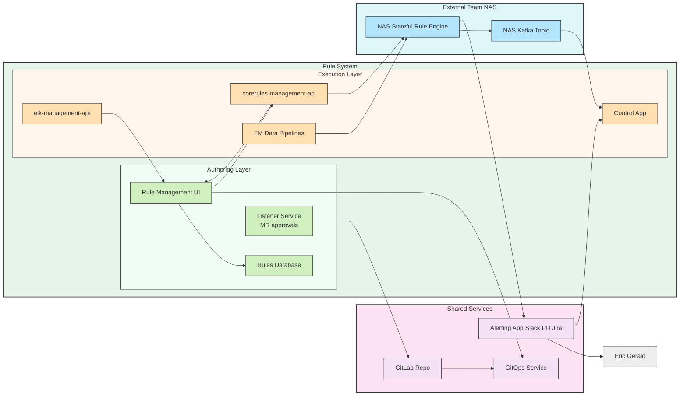

---

# 🔹 High-Level Design Explanation

## 1. **Authoring Layer**

* **Rule Management UI**

  * Central place for users to **create, edit, and manage rules**.
  * Supports both DSL-style conditions and correlation rules.
  * Triggers GitOps flow for auditability.

* **Rules Database**

  * Persistent storage of authored rules.
  * Backed by versioning — rule changes (add/update/delete) generate new versions.

* **Listener Service**

  * Listens to **Merge Request approvals** in GitLab.
  * Ensures rule changes go through **review + audit trail** before activation.

---

## 2. **Execution Layer**

* **elk-management-api**

  * Exposes ELK-related rule endpoints (fetching, validating, caching rules from Kibana).
  * UI calls it to get field metadata and rule details.

* **corerules-management-api**

  * The main service that **applies user-defined rules**.
  * Forwards rules to NAS rule engine for execution.
  * Ensures GitOps consistency (rules applied only after MR approval).

* **FM Data Pipelines**

  * Raw **fault/performance/config events** feeding into the rulesystem.
  * Provide event streams that the rule engine evaluates against.

* **Control App**

  * Downstream consumer of evaluated rules and actions.
  * Uses rule decisions to drive network operations (toggling, reporting, etc.).

---

## 3. **Shared Services**

* **GitOps Service**

  * Orchestrates rule change approvals.
  * Ensures that all changes flow through GitLab → GitOps → rule APIs.
  * Provides full **audit and rollback** capability.

* **GitLab Repo**

  * Stores rule definitions as code (YAML/DSL).
  * MRs capture change history.
  * Listener ties approvals to runtime activation.

* **Alerting App**

  * Shared across systems.
  * Delivers notifications to **Slack, PagerDuty, Jira**.
  * Decouples rule engine from specific alert destinations.

---

## 4. **External NAS**

* **NAS Rule Engine (stateful)**

  * Owned by another team.
  * Executes incoming rules (single-event and correlation).
  * Stateful: maintains counters, timers, and correlation logic.

* **NAS Kafka Topic**

  * Publishes evaluated events and actions.
  * Internal consumers (like Control App) subscribe.
  * Also feeds into alerting workflows.

---

## 5. **Downstream Consumers**

* **Eric Gerald Service**

  * Independent service that **subscribes to Alerting App outputs**.
  * Shows that alerting is not linear or tightly coupled — multiple systems consume alerts.

---

# 🔹 End-to-End Flow (Happy Path)

1. User defines/edits rule in **UI**.
2. Rule saved in **RulesDB**, GitOps flow triggered.
3. MR created → **Listener** enforces approvals → merged to GitLab.
4. GitOps pushes approved rules → **corerules-management-api**.
5. Events from FM → **NAS Rule Engine**.
6. Engine evaluates events against approved rules.
7. Results → **NAS Kafka Topic**.
8. Actions → **Control App** + **Alerting App**.
9. Alerts delivered to **Slack/PagerDuty/Jira**.
10. **Eric Gerald** and other services consume alerts.

---

# 🔹 Challenges Addressed

* **Auditability** → GitOps ensures rules are reviewed before activation.
* **Extensibility** → ELK, CoreRules, FM can evolve independently.
* **Decoupling** → Alerting App is shared, so new consumers (Eric Gerald, future tools) can plug in easily.
* **Separation of ownership** → NAS is external; RuleSystem integrates without dictating implementation.

---

✅ With this design, rules move **from user intent → approved GitOps artifact → execution → actions/alerts**, all while maintaining **stateful correlation logic, audit trails, and shared service integration**.

---
