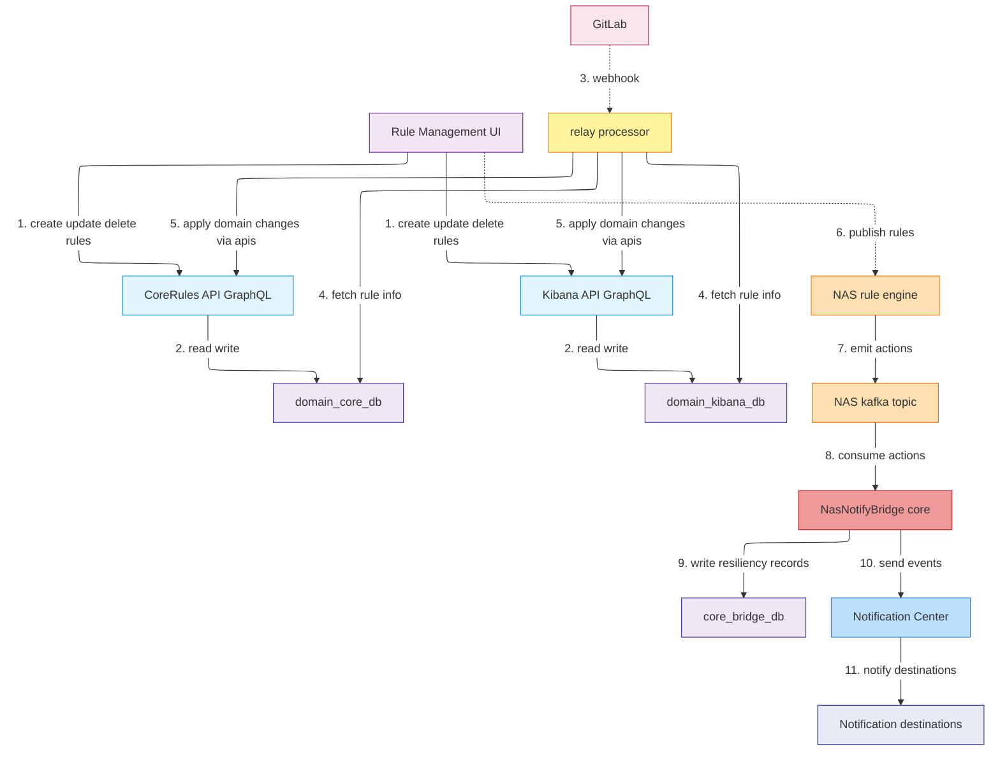
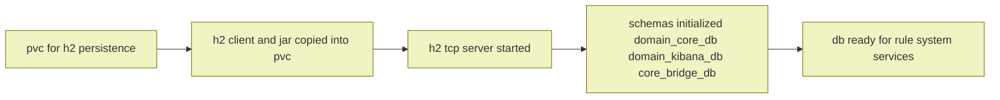

```mermaid
%%{init: {
  "theme": "default",
  "themeVariables": { "edgeLabelBackground": "#ffffff" },
  "flowchart": { "curve": "elk" }
}}%%
flowchart TB
 subgraph DS["Domain APIs"]
        ELK["ELK API GraphQL"]
        CORE["CoreRules API GraphQL"]
  end
 subgraph UIA["Rule Management UI"]
        UI["UI"]
  end
 subgraph RELAY["Relay Processor"]
        RP["relay processor"]
  end
 subgraph BRIDGE["NasNotifyBridge"]
        CTRL["NasNotifyBridge service"]
  end
 subgraph DBS["Databases H2 persistent on pvc"]
        ELK_DB["ELK domain db"]
        CORE_DB["CoreRules domain db"]
        RELAY_DB["relay state db"]
        BRIDGE_DB["bridge resiliency db"]
  end
 subgraph RS["Rule System"]
        DS
        UIA
        RELAY
        BRIDGE
        FDP["FM Data Pipelines"]
        DBS
  end
 subgraph EXT_ALERTS["Notification destinations"]
        PD["PagerDuty"]
        SLK["Slack"]
        EM["Email"]
        JIRA["Jira"]
  end
 subgraph SA["Shared apps"]
        GITOPS["GitOps governance"]
        NC["Notification Center"]
        EXT_ALERTS
        GIT["GitLab"]
  end
 subgraph NWCA["NWCA managed services"]
        RS
        SA
  end
 subgraph NAS["NAS rule engine managed by AIOPS"]
        NASRE["NAS rule engine"]
        NASK["NAS kafka topic"]
  end
 subgraph EXTENG["External engines"]
        NAS
        KIB["Kibana analytics managed by EDP"]
  end
 subgraph DEPLOY["Deployment plan"]
        PVC["create pvc for h2 persistence"]
        SVC["deploy rule system and shared app pods"]
        DBINIT["initialize h2 schema and tables"]
  end
 subgraph OTHER_SYS["Other systems using notification center"]
        S1["CoreOps"]
        S2["NOC automation"]
  end
    ELK -- read write --> ELK_DB
    CORE -- read write --> CORE_DB
    RP -- enqueue retry checkpoints --> RELAY_DB
    RELAY_DB -- dequeue next attempts --> RP
    CTRL -- write resiliency records --> BRIDGE_DB
    BRIDGE_DB -- read retry entries --> CTRL
    RP -- fetch rule info --> ELK_DB & CORE_DB
    UI -- create update delete rules --> ELK & CORE
    ELK -- get rules graphql --> UI
    CORE -- get rules graphql --> UI
    RP -- apply domain changes via apis --> ELK & CORE
    FDP -. data feed .-> NASRE
    UI -. publish rules .-> NASRE
    NASRE -- emit actions --> NASK
    NASK -- consume actions --> CTRL
    CTRL -- send events --> NC
    GITOPS --> NC
    NC -- triggers --> PD
    NC --> SLK & EM & JIRA
    ELK -. analytics and monitoring data .-> KIB
    CORE -. analytics and monitoring data .-> KIB
    GIT -. webhook .-> RP
    GITOPS -. audit and drift check .-> ELK_DB & CORE_DB
    OTHER_SYS -. use notification api .-> NC
    PVC -.-> SVC
    SVC -.-> DBINIT
    DBINIT -.-> RS & SA
     ELK:::api
     CORE:::api
     UI:::ui
     RP:::relay
     CTRL:::ctrl
     ELK_DB:::db_elastic
     CORE_DB:::db_core
     RELAY_DB:::db_relay
     BRIDGE_DB:::db_bridge
     FDP:::pipeline
     PD:::alertdest
     SLK:::alertdest
     EM:::alertdest
     JIRA:::alertdest
     GITOPS:::gitops
     NC:::notif
     GIT:::gitlab
     NASRE:::nas
     NASK:::nas
     KIB:::kib
     PVC:::deploy
     SVC:::deploy
     DBINIT:::deploy
    classDef api fill:#e1f5fe,stroke:#0288d1
    classDef ui fill:#f3e5f5,stroke:#6a1b9a
    classDef relay fill:#fff59d,stroke:#f57f17
    classDef ctrl fill:#ef9a9a,stroke:#b71c1c
    classDef pipeline fill:#e8f5e9,stroke:#2e7d32
    classDef gitops fill:#b2ebf2,stroke:#006064
    classDef notif fill:#bbdefb,stroke:#0d47a1
    classDef alertdest fill:#e8eaf6,stroke:#283593
    classDef gitlab fill:#fce4ec,stroke:#ad1457
    classDef nas fill:#ffe0b2,stroke:#ef6c00
    classDef kib fill:#c8e6c9,stroke:#2e7d32
    classDef db_elastic fill:#ede7f6,stroke:#5e35b1
    classDef db_core fill:#ede7f6,stroke:#4527a0
    classDef db_relay fill:#fff8e1,stroke:#f9a825
    classDef db_bridge fill:#ffecb3,stroke:#ffa000
    classDef deploy fill:#f0f4c3,stroke:#827717
    style DBS fill:#f3e5f5,stroke:#4527a0,stroke-width:1.5px
    style RS fill:#f1f8e9,stroke:#558b2f,stroke-width:1.5px
    style SA fill:#e0f7fa,stroke:#006064,stroke-width:1.5px
    style OTHER_SYS fill:#fffde7,stroke:#f57f17,stroke-width:1.5px
    style NWCA fill:#fff8e1,stroke:#8d6e63,stroke-width:1.5px
    style EXTENG fill:#fff3e0,stroke:#ef6c00,stroke-width:1.5px
    style DEPLOY fill:#f9fbe7,stroke:#827717,stroke-width:1.5px
    linkStyle 0 stroke:#558b2f,stroke-width:1.6px,color:#33691e,fill:none
    linkStyle 1 stroke:#558b2f,stroke-width:1.6px,color:#33691e,fill:none
    linkStyle 2 stroke:#558b2f,stroke-width:1.6px,color:#33691e,fill:none
    linkStyle 3 stroke:#558b2f,stroke-width:1.6px,color:#33691e,fill:none
    linkStyle 4 stroke:#558b2f,stroke-width:1.6px,color:#33691e,fill:none
    linkStyle 5 stroke:#558b2f,stroke-width:1.6px,color:#33691e,fill:none
    linkStyle 6 stroke:#558b2f,stroke-width:1.6px,color:#33691e,fill:none
    linkStyle 7 stroke:#558b2f,stroke-width:1.6px,color:#33691e,fill:none
    linkStyle 8 stroke:#558b2f,stroke-width:1.6px,color:#33691e,fill:none
    linkStyle 9 stroke:#558b2f,stroke-width:1.6px,color:#33691e,fill:none
    linkStyle 10 stroke:#558b2f,stroke-width:1.6px,color:#33691e,fill:none
    linkStyle 11 stroke:#558b2f,stroke-width:1.6px,color:#33691e,fill:none
    linkStyle 12 stroke:#558b2f,stroke-width:1.6px,color:#33691e,fill:none
    linkStyle 13 stroke:#558b2f,stroke-width:1.6px,color:#33691e,fill:none
    linkStyle 14 stroke:#ef6c00,stroke-width:1.6px,color:#bf360c,fill:none
    linkStyle 15 stroke:#ef6c00,stroke-width:1.6px,color:#bf360c,fill:none
    linkStyle 16 stroke:#ef6c00,stroke-width:1.6px,color:#bf360c,fill:none
    linkStyle 17 stroke:#ef6c00,stroke-width:1.6px,color:#bf360c,fill:none
    linkStyle 18 stroke:#1565c0,stroke-width:1.6px,color:#0d47a1,fill:none
    linkStyle 19 stroke:#1565c0,stroke-width:1.6px,color:#0d47a1,fill:none
    linkStyle 20 stroke:#1565c0,stroke-width:1.6px,color:#0d47a1,fill:none
    linkStyle 21 stroke:#1565c0,stroke-width:1.6px,color:#0d47a1,fill:none
    linkStyle 22 stroke:#1565c0,stroke-width:1.6px,color:#0d47a1,fill:none
    linkStyle 23 stroke:#1565c0,stroke-width:1.6px,color:#0d47a1,fill:none
    linkStyle 24 stroke:#2e7d32,stroke-width:1.6px,color:#1b5e20,stroke-dasharray:3 3,fill:none
    linkStyle 25 stroke:#2e7d32,stroke-width:1.6px,color:#1b5e20,stroke-dasharray:3 3,fill:none
    linkStyle 26 stroke:#757575,stroke-width:1.4px,stroke-dasharray:3 3,color:#424242,fill:none
    linkStyle 27 stroke:#757575,stroke-width:1.4px,stroke-dasharray:3 3,color:#424242,fill:none
    linkStyle 28 stroke:#757575,stroke-width:1.4px,stroke-dasharray:3 3,color:#424242,fill:none
    linkStyle 29 stroke:#757575,stroke-width:1.4px,stroke-dasharray:3 3,color:#424242,fill:none
    linkStyle 30 stroke:#9e9d24,stroke-width:1.4px,stroke-dasharray:3 3,color:#827717,fill:none
    linkStyle 31 stroke:#9e9d24,stroke-width:1.4px,stroke-dasharray:3 3,color:#827717,fill:none
    linkStyle 32 stroke:#9e9d24,stroke-width:1.4px,stroke-dasharray:3 3,color:#827717,fill:none
    linkStyle 33 stroke:#9e9d24,stroke-width:1.4px,stroke-dasharray:3 3,color:#827717,fill:none

```

# **Rule System – Technical Architecture Overview (NWCA)**

---

---

## **1. Technical Objective**

The **Rule System** is a centralized, event-driven framework managed by **NWCA** for defining, validating, executing, and synchronizing automation rules across multiple domains.
It integrates with:

* **NAS (AIOPS)** for execution,
* **Kibana (EDP)** for analytics, and
* **NWCA Shared Services** for governance and notifications.

It emphasizes **stateful reliability**, **governance control**, and **observability**, running entirely within the OpenShift namespace under NWCA ownership.

---

## **2. Technical Architecture Summary**

| Layer                     | Components                                                       | Responsibility                                                                     |
| ------------------------- | ---------------------------------------------------------------- | ---------------------------------------------------------------------------------- |
| **Ingress**               | **Rule Management UI**, **GitLab Webhooks**                      | Capture rule definitions (UI) and propagate changes through GitOps workflows.      |
| **Core Rule System**      | **Domain APIs**, **Relay Processor**, **NasNotifyBridge (Core)** | Manage rule lifecycle, synchronize changes, and bridge NAS events for Core domain. |
| **Persistence**           | **H2 (PVC-backed TCP mode)**                                     | Central persistent data layer for all NWCA services; shared schemas per domain.    |
| **Governance**            | **GitOps Governance**                                            | Auditing, approval workflows, and drift detection.                                 |
| **Execution & Analytics** | **NAS (AIOPS)**, **Kibana (EDP)**                                | NAS executes automation logic; Kibana visualizes rule analytics and performance.   |
| **Notifications**         | **Notification Center**                                          | Broadcasts rule outcomes and alerts to Slack, PagerDuty, Email, and Jira.          |

---

## **3. Persistence and Pre-Deployment Setup**

### **Independent Database Repository**

The **H2 + PVC setup** exists as a **separate deployment repository**, executed **prior to main system deployment**.

| Step                          | Action                                                                                                            |
| ----------------------------- | ----------------------------------------------------------------------------------------------------------------- |
| **1. PVC Provisioning**       | The `rule-system-h2-pvc` PVC is created via Helm in the `rule-db-setup` repo.                                     |
| **2. Binary Injection**       | The H2 binary (`h2-2.3.x.jar`) and startup scripts are copied into the PVC’s `/opt/nwca/h2data/h2client/` folder. |
| **3. Schema Initialization**  | Schema DDL scripts run for each domain before the main Rule System comes online.                                  |
| **4. Namespace Registration** | The TCP server (`h2-service:9092`) is registered inside the namespace and verified via readiness probes.          |

This design ensures the DB is **fully bootstrapped before any NWCA service deployment**, minimizing startup dependency chains.

---

### **Schema Overview**

| Schema             | Description                                                                | Domain    |
| ------------------ | -------------------------------------------------------------------------- | --------- |
| **domain_elk_db**  | Holds rule metadata and validation results for the ELK domain.             | ELK       |
| **domain_core_db** | Contains CoreRules definitions and rule status snapshots.                  | Core      |
| **relay_state_db** | Tracks relay events, retry checkpoints, and offset metadata.               | Shared    |
| **core_bridge_db** | Specific to `NasNotifyBridge`; stores NAS event outcomes and retry states. | Core Only |

Each schema resides in the same H2 TCP instance but under **distinct namespaces**, ensuring isolation while retaining shared persistence.

---

## **4. Deployment Design**

The deployment sequence across repos follows a clear order to maintain readiness and state consistency:

| Phase       | Repo                    | Description                                                                                                          |
| ----------- | ----------------------- | -------------------------------------------------------------------------------------------------------------------- |
| **Phase 1** | `rule-db-setup`         | Deploy PVC, start H2 TCP server, initialize schemas (domain_elk_db, domain_core_db, relay_state_db, core_bridge_db). |
| **Phase 2** | `rule-system`           | Deploy Domain APIs, UI, Relay Processor, and NasNotifyBridge.                                                        |
| **Phase 3** | `shared-services`       | Deploy GitOps Governance and Notification Center.                                                                    |
| **Phase 4** | `external-integrations` | Connect NAS (AIOPS), Kibana (EDP), and downstream notification channels.                                             |

---

## **5. Event and Data Flow**

Below is a simplified, high-level sequence that captures how data moves across the ecosystem.

### H2 Deployment and Initialization

---

### **Flow Description**

| Step   | Component           | Description                                                                                       |
| ------ | ------------------- | ------------------------------------------------------------------------------------------------- |
| **1.** | Rule Management UI  | Users create or modify rules via UI.                                                              |
| **2.** | Domain APIs         | APIs validate, persist, and maintain domain-specific rule metadata in H2 schemas.                 |
| **3.** | GitLab Webhook      | On merge approval, GitOps emits webhook to Relay Processor.                                       |
| **4.** | Relay Processor     | Syncs approved rule definitions across domains, updates DBs, and triggers publication.            |
| **5.** | NAS (AIOPS)**       | Receives rule definitions for runtime evaluation.                                                 |
| **6.** | NAS Execution       | Emits actionable results on Kafka topic.                                                          |
| **7.** | NasNotifyBridge     | Consumes results, stores in `core_bridge_db` for resiliency, and forwards to Notification Center. |
| **8.** | Kibana (EDP)**      | Receives metrics from Domain APIs for visualization.                                              |
| **9.** | Notification Center | Aggregates final state and sends alerts to PagerDuty, Slack, Email, and Jira.                     |

---

## **6. Resilience and Recovery**

| Mechanism                 | Description                                                                                               |
| ------------------------- | --------------------------------------------------------------------------------------------------------- |
| **Retry Queues**          | Relay Processor and NasNotifyBridge maintain DB-backed retry queues (`relay_state_db`, `core_bridge_db`). |
| **Crash Recovery**        | PVC ensures that retry states and schema data persist through pod restarts.                               |
| **Isolation by Domain**   | Each domain’s schema (`domain_core_db`, `domain_elk_db`) maintains independent transactions.              |
| **Idempotent Operations** | Relay and Domain APIs are designed to handle duplicate event delivery safely.                             |
| **Auto-Healing**          | Liveness and Readiness probes (via Spring Boot Actuator) validate service and DB health continuously.     |

---

## **7. Integration and Extensibility**

| System                  | Managed By | Integration Type | Description                                                    |
| ----------------------- | ---------- | ---------------- | -------------------------------------------------------------- |
| **NAS**                 | AIOPS      | Kafka (async)    | Executes rule logic, emits operational events for automation.  |
| **Kibana**              | EDP        | REST (sync)      | Visualizes rule execution, health metrics, and alert patterns. |
| **GitOps**              | NWCA       | Webhook + REST   | Controls change approval, validation, and drift detection.     |
| **Notification Center** | NWCA       | REST / Fanout    | Distributes alerts to Slack, PagerDuty, Email, and Jira.       |
| **Future Integrations** | NWCA       | REST / Stream    | Extensible to Grafana or GCP Data Pipelines.                   |

---

## **8. Observability and Maintenance**

* **Metrics:**
  Each service exports Prometheus metrics (`/actuator/prometheus`), including relay queue size, event lag, and NAS message delay.
* **Logs:**
  Centralized via NWCA’s ELK stack with service-level tags for quick correlation.
* **Validation Jobs:**
  Nightly job validates schema consistency between the PVC and codebase.
* **Manual Access:**
  Engineers can exec into any pod and use `/opt/nwca/h2client/h2-2.3.x.jar` for inspection.

---

## **9. Summary**

The **Rule System technical design** guarantees:

* **Governed, stateful automation** with clear domain separation and traceability.
* **Resilient, persistent architecture** through a dedicated PVC-backed H2 database.
* **Multi-domain interoperability** via modular APIs and GitOps pipelines.
* **Reliable automation feedback loop** between NAS (execution), Kibana (analytics), and Notification Center (visibility).

This setup ensures the **NWCA Rule System** remains extensible, recoverable, and auditable across all operational environments.
