# 🔹 Rule Engine Detailed Explanation

The Rule Engine is designed as a **stateful, horizontally scalable system** that processes both **single-event DSL rules** and **multi-event correlation rules**. It achieves this by splitting responsibilities across services and Kafka topics, ensuring durability, auditability, and extensibility.

---

## 1. Inbound & Routing

* **Raw Events** arrive via `raw-events` topic (unkeyed, high-volume stream).
* **Channel Router Service** consumes raw-events, normalizes them into a **common DTO**, and derives a **channelId** (usually `domain+bizId`).
* Router republishes the event to `channel-events` topic **keyed by channelId**, ensuring **per-channel ordering**.
* Router is **stateless** and can scale freely without concern for state recovery.

**Challenge solved:**
👉 Avoids reliance on external partitions or pre-registered keys. Events are dynamically keyed at runtime, so channels can scale up/down with business IDs that appear or disappear.

---

## 2. Processing

* **Channel Processor Service** consumes `channel-events`. Each partition is owned by one processor pod, guaranteeing ordered delivery for each channelId.
* The processor manages active channels via **ChannelActors** (lightweight state machines).

Each ChannelActor:

1. Receives ordered events.
2. Applies rules via **RuleRegistry**.
3. Updates state (counters, timers, buffers).
4. Periodically snapshots state into `channel-state` (compacted topic).

---

### Rule Evaluation Layers

1. **DSL Evaluator (Single Event, Lightweight)**

   * Simple expressions like `cpu > 90`.
   * Stateless, executes immediately.

2. **Single Event Evaluator (Domain Strategy)**

   * More advanced, domain-specific rules.
   * Example: *severity >= major → escalate*.

3. **Correlation Evaluator (Multi-event, Stateful)**

   * Rules spanning multiple events/timers.
   * Examples:

     * *Flapping*: N `AlarmNew` within T minutes.
     * *Clear*: `AlarmClear` within T → resolve.
     * *No Clear*: timer expires → escalate.

---

### Timer Scheduler

* Manages timers for correlation rules.
* Hot timers are in-memory; intents persisted in `channel-state`.
* If pod crashes, timers are restored from snapshot + replay.

---

## 3. Rule Management

* **Rules UI Admin** allows creation/edit of DSL or correlation rules.
* Changes stored in **Rules DB**, compiled into a **runtime representation**.
* A **Rules Compiler Service** emits updates into `rule-updates` (compacted topic).
* Each processor has a **RuleRegistry** subscribed to `rule-updates`.

**Hot reload:**

* On receiving a new version, RuleRegistry swaps its in-memory ruleset using atomic references.
* All new events use the latest ruleset, while existing channel state is carried forward.

---

### Challenge: Rule changes midstream

Rules may be **added, updated, or removed** while events are being processed.

Solutions:

1. **Versioned rulesets**: every change increments a version. Channels can pin to a version while in-flight, then roll forward.
2. **Soft roll** (default): new events use the new ruleset, existing timers finish on the old ruleset.
3. **Hard cutover** (explicit): rules define migration logic (`onRuleChange`, `onDeactivate`) to reschedule timers or adjust counters.

👉 This allows safe evolution of rules without dropping state or creating duplicate actions.

---

## 4. Dispatch

* Evaluators emit **actions** (e.g., `triggerAlert`, `markFlapping`, `resolveAlarm`).
* Instead of pushing directly to alerting, actions are published to `rule-actions` (Kafka topic).
* **Action Notifier Service** consumes `rule-actions` and performs side effects:

  * Notify Alerting App (Slack, PagerDuty, Jira).
  * Persist to **Audit Logs**.
  * Write to `processed-events` topic for dashboards/other consumers.

**Challenge solved:**
👉 Decouples evaluation from side effects. Future action types (like “open ticket” or “scale resource”) just plug into the notifier, without changing the rule processor.

---

## 5. State Management & Recovery

* Active channels (hot) are stored in memory.
* Idle channels are evicted but snapshotted to `channel-state`.
* On crash or pod reschedule:

  * Processor reloads the channel snapshot.
  * Resumes from last offset.
  * Replays events from `channel-events` to catch up.

**Challenge solved:**
👉 This ensures stateful correlation logic (timers, counters) survives failures without external infra like Flink.

---

# 🔹 Challenges & How They’re Addressed

### 1. **Rule refresh under HPA scaling**

* Push model via `rule-updates` Kafka topic.
* All processors subscribe and hot reload atomically.
* Ensures consistent rule application across replicas.

### 2. **Processor handling midstream rule changes**

* Versioned rulesets.
* Soft vs hard cutover handling.
* Migration hooks for correlation state.

### 3. **State survival on crash**

* Snapshots in `channel-state` compacted topic.
* Replay from `channel-events` guarantees recovery.
* Timers persisted as intents.

### 4. **Channel growth (100k+ active IDs)**

* LRU + idle timeout eviction.
* Only hot channels live in memory.
* Warm channels in snapshots.
* Cold channels only in compacted Kafka state.

### 5. **Notification flexibility**

* All actions routed through `rule-actions` Kafka topic.
* Notifier handles Slack, PagerDuty, Jira today.
* Easily extended to new consumers without touching processor logic.

---

# 🔹 Why this Rule Engine Design Works

* **Separation of concerns**: Router → Processor → Notifier.
* **Durability**: Kafka topics (`channel-events`, `channel-state`, `rule-updates`, `rule-actions`) provide replay and recovery.
* **Scalability**: HPA safe, per-channel ordering via keyed topics.
* **Extensibility**: DSL → Single Event → Correlation → future action types.
* **Governance**: Rules go through DB + Compiler + GitOps flow before reaching runtime.


✅ With this, you have a **self-contained, Kafka-backed rule engine** that can grow from DSL to correlation without Flink/Esper infra overhead.

---

# 🔹 Explanation of An Individual Channel's Lifecycle


### **Ingress**

* **NewEvent → Idle → Active**

  * A channel starts when the **first event** arrives for a channelId.
  * Initially, there’s no in-memory state (`Idle`).
  * The first event transitions the channel into `Active`.

---

### **Channel States**

1. **Idle**

   * Channel does not exist in memory.
   * Created when the first event arrives.
   * Lightweight, no timers or counters.

2. **Active**

   * Main state: channel is actively processing ordered events.
   * Applies rules (DSL, single-event, correlation).
   * Periodically persists a **snapshot** to durable storage (e.g., every N events or T seconds).

3. **Waiting**

   * Entered when a **timer** is scheduled (e.g., expect `AlarmClear` within 5 minutes).
   * Channel remains hot in memory.

4. **Escalated**

   * If timer expires without expected event, correlation rule escalates.
   * Emits an **action** (e.g., trigger alert).
   * Then transitions back to Active to handle new events.

5. **Evicted**

   * Channel becomes inactive (no events for a while) or memory pressure forces eviction.
   * Channel’s state is **snapshotted** to `channel_state` compacted topic.
   * Any active timers are persisted to `timer_intents`.

6. **Restored**

   * On a new event, channel reloads its snapshot from `channel_state`.
   * Restores timers from `timer_intents`.
   * Replays missed events from Kafka (`channel-events`).
   * Returns to `Active`.

7. **Retired**

   * Permanent end state.
   * Happens if the **rule is deleted**, or system garbage-collects the channel.
   * State and timers are dropped.

---

### **Persistence Layer**

* **channel_state (Snapshot)**

  * Compacted Kafka topic storing counters, buffers, offsets.
  * Ensures channel recovery after crash or eviction.

* **timer_intents (Timers)**

  * Persisted timers that survive pod restarts.
  * Guarantees correlation rules (like “no clear in 5m”) continue after recovery.

---

### **Rule Context**

* **RulesetPinned**

  * Each channel is bound to a **specific ruleset version** when processing.
  * Prevents inconsistency midstream if new rules arrive.

* **SoftCutover**

  * Default update path.
  * New events use updated rules, while **existing timers finish under old version**.
  * Non-disruptive.

* **HardCutover**

  * Forced update path.
  * Cancels timers, migrates counters, immediately switches to new ruleset.
  * Used for urgent fixes.

---

# 🔹 Challenges Reflected in Flow

1. **State survival**

   * Eviction → snapshot and timers persisted.
   * Restored → reload and replay.

2. **Timer handling**

   * Must survive eviction and crashes.
   * Efficient management required to handle millions.

3. **Rule changes**

   * RulesetPinned + Soft/Hard cutover ensure consistent handling.
   * Without this, channels could evaluate different rules inconsistently.

4. **Channel growth**

   * Many channelIds (e.g., 100k+) possible.
   * Idle eviction prevents memory explosion.

---

# 🔹 Unified Rule Engine Flow with Rule Lifecycle

```mermaid
%%{init: {"sequence": {"mirrorActors": false, "showSequenceNumbers": true}, "themeVariables": {"actorBorder":"#333","actorBkg":"#fafafa","signalColor":"#333","signalTextColor":"#333","noteBkgColor":"#fff8dc","noteTextColor":"#333"}}}%%
sequenceDiagram
    participant RawEvents as Kafka raw-events
    participant Router as Channel Router
    participant ChannelEvents as Kafka channel-events
    participant Processor as Channel Processor
    participant RuleRegistry as Rule Registry
    participant Evaluators as Evaluators (DSL/Single/Correlation)
    participant State as Kafka channel-state
    participant Timers as Timer Scheduler
    participant Actions as Kafka rule-actions
    participant Notifier as Action Notifier
    participant Alerts as Alerting Apps
    participant RulesMgmt as Kafka rule-updates

    rect rgb(230,255,230)
    Note over RawEvents,Alerts: ✅ Happy Path: Normal Event Processing
    RawEvents ->> Router: New event arrives
    Router ->> ChannelEvents: Repackaged with channelId key
    ChannelEvents ->> Processor: Ordered delivery per channel
    Processor ->> RuleRegistry: Fetch active ruleset (pinned version)
    Processor ->> Evaluators: Apply matching rules
    Evaluators -->> Processor: Actions / State changes / Timers
    Processor ->> Timers: Schedule or cancel timers
    Processor ->> State: Persist snapshot
    Processor ->> Actions: Publish Action
    Actions ->> Notifier: Deliver Action
    Notifier ->> Alerts: Notify Slack / PagerDuty / Jira
    end

    rect rgb(255,250,200)
    Note over RulesMgmt,Processor: 🔄 Rule Add/Update Flow
    RulesMgmt ->> RuleRegistry: Push new ruleset version
    Note over RuleRegistry: Soft Cutover = new events use new rules,<br/>timers finish under old version
    Note over RuleRegistry: Hard Cutover = migrate state + timers,<br/>force channels to switch to new version
    RuleRegistry -->> Processor: Hot swap active ruleset (atomic)
    end

    rect rgb(255,220,220)
    Note over RulesMgmt,Processor: ❌ Rule Delete Flow
    RulesMgmt ->> RuleRegistry: Mark rule as deleted
    RuleRegistry ->> Processor: Propagate deletion
    Processor ->> Evaluators: Stop applying rule, cancel timers
    Evaluators -->> Processor: Confirm rule removal
    Processor ->> State: Update snapshots to drop rule context
    end
```



---

# 🔹 Explanation

### ✅ Happy Path (green block)

* Events flow `raw-events → router → channel-events → processor`.
* Processor fetches active ruleset and applies evaluators.
* State + timers persisted.
* Actions published → Notifier → Slack/PagerDuty/Jira.

### 🔄 Rule Add/Update (yellow block)

* RulesMgmt publishes **new version** to `rule-updates`.
* **Soft Cutover**: new events use updated logic; existing timers finish under old version.
* **Hard Cutover**: state migrated, timers rescheduled, all channels switch immediately.
* RuleRegistry ensures atomic swap across Processor pods.

### ❌ Rule Delete (red block)

* Rule marked deleted in RulesMgmt.
* RuleRegistry propagates deletion to all processors.
* Evaluators stop applying it, cancel timers, clean state.
* Snapshots updated to drop rule context.

---

# 🔹 Versioning Model

### Entities

1. **Rule**

   * Atomic unit of evaluation (e.g., DSL expression, correlation condition).
   * Has a stable `ruleId`.
   * Belongs to a `rulesetVersion`.

2. **Ruleset**

   * Collection of rules for a domain (`elk`, `coreRules`, etc.).
   * Each update → increments `rulesetVersion`.
   * Propagated to processors via `rule-updates` topic.

3. **Channel Pin**

   * Each channel (bizId) **pins** to the current ruleset version when processing events.
   * Ensures consistency during midstream rule changes.
   * On next event, channel may roll forward to a newer version (soft cutover).

---

# 🔹 Rule Metadata (in Kafka rule-updates)

```json
{
  "rulesetId": "coreRules",
  "rulesetVersion": 42,
  "ruleChanges": [
    {
      "ruleId": "flapping-001",
      "action": "UPSERT",
      "definition": {
        "type": "CORRELATION",
        "domain": "core",
        "when": { "event": "AlarmNew", "count": ">1", "window": "3m" },
        "then": { "action": "mark_flapping" }
      }
    },
    {
      "ruleId": "clear-002",
      "action": "DELETE"
    }
  ],
  "changedAt": "2025-09-29T12:34:56Z",
  "author": "fahad"
}
```

* `UPSERT` = add new or update existing rule.
* `DELETE` = mark rule inactive.
* Each message is **idempotent** (compacted topic).
* Pods just hot-reload the latest `rulesetVersion`.

---

# 🔹 How Processors Handle Rule Versions

### Soft Cutover (default)

* Channel pinned to `rulesetVersion=41`.
* New ruleset 42 arrives.
* Existing **timers/counters** keep running under version 41.
* On next **new event**, channel upgrades to version 42 automatically.
* No disruption to in-flight correlation.

### Hard Cutover (explicit)

* Ruleset 42 marked as **hard cutover**.
* RuleRegistry tells processors:

  * Cancel existing timers.
  * Migrate state if possible (`onRuleChange` hook).
  * Immediately pin all channels to version 42.
* Used for urgent rule fixes (e.g., wrong threshold).

---

# 🔹 Channel Pinning Example

* Biz123 is processing with **ruleset v41**.
* Rule flapping-001 says: “>1 AlarmNew in 3m”.
* Midway, ruleset v42 changes threshold to “>2 AlarmNew in 3m”.

👉 With **soft cutover**:

* Existing counter in Biz123 still evaluates “>1” until flushed.
* Next new event resets channel to v42 → “>2”.

👉 With **hard cutover**:

* Processor cancels current counter.
* Replaces with new counter logic.
* Biz123 immediately evaluates “>2”.

---

# 🔹 Rule Delete Flow

* Rule marked `DELETE` in `rule-updates`.
* Processor:

  * Cancels associated timers.
  * Removes counters from channel state.
  * Updates snapshot in `channel-state`.
* Channels pinned to old version won’t see the rule after deletion event.

---

# 🔹 Why This Works

* **Consistency**: channels process events against a single ruleset version at a time.
* **Flexibility**: both soft (non-disruptive) and hard (urgent) updates possible.
* **Auditability**: `rule-updates` topic stores full history of changes with author + timestamp.
* **Durability**: even if pods restart, compacted topic replays last known version.

---
